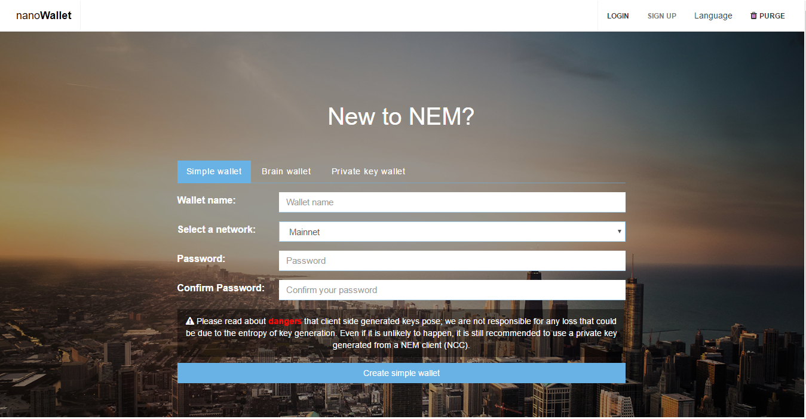

## 2 Creating a Wallet
From the NanoWallet starting interface, select "SIGN UP."

In this guide, we will create a simple wallet. If you want to learn about the different wallet types, it's covered later in this guide.

1. Make sure the Simple Wallet tab is selected.
2. Enter a wallet name. Example: LonsFirstWallet
3. Choose a network. Mainnet is recommended for most users. (Testnet is for software testing only. Mijin is for permissioned chains.)
4. Enter a password. Example: correcthorsebatterystaple
5. Press "Create simple wallet" button.
