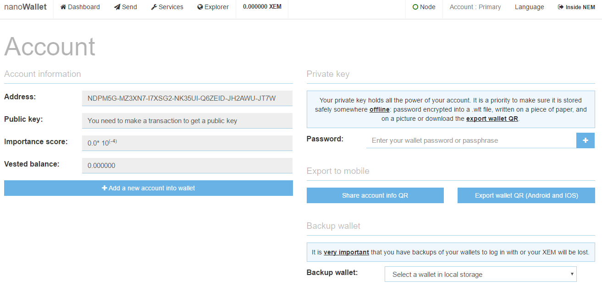
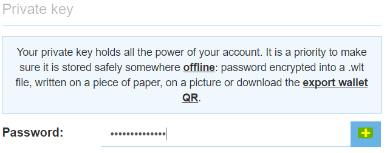
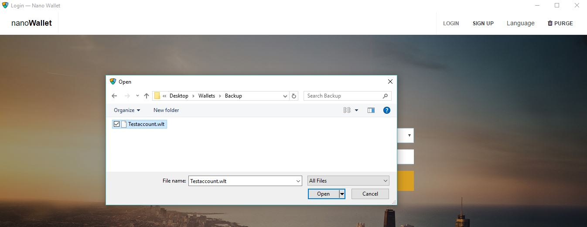

## 3 Log in and backup
Open the login page, select your wallet, enter the password and log in.  

If you are using a browser-based wallet, when you log in for the first time, your browser downloads a backup of your wallet called a .wlt file. More on backups and .wlt files later in this guide.

 

You are now presented with the dashboard. The dashboard shows some basic information about your account and harvesting income. There is also market information to keep track of the exchange rate.

Open "Account" by clicking on it in the top right corner of the NanoWallet. Account Information shows your NEM address, which you use for receiving funds. (It also shows three items that are used for harvesting: your public key, importance score, and your vested balance. Read more on harvesting for details.)

From here you can also create a backup of your wallet.
**We recommend backing up to a file AND to paper!**

### 3.1 Backup to a file
Select the account you want to backup in "Backup wallet." Dowload the backup .wlt file.
 
You can make copies and store your .wlt file on USB thumb drives, USB hard drives, and network storage. We recommend encrypting the file with a tool like TrueCrypt or 7-zip before storing it drives that others may be able to access.
 
**Reminder: Without your password your wallet file is useless!**

### 3.2 Backup to  paper
If you don't want to save a .wlt file, you can also use your private key as a backup of your account.

First go to the Account page.

Enter your password on the "Private key" section on the right side of the account page and press "+".

When you enter the password it shows your private key, which is a 64-digit series of numbers and letters.

You can now either write this code on a paper or take a screenshot to print it out. Store it in a safe place. Do not store it or save it where others may be able to copy it.

### 3.3 Import a .wlt file to NanoWallet
To add a saved account to a NanoWallet, open the NanoWallet login screen and press Import Wallet.

This will open a file explorer window. Navigate to the saved .wlt file you want to add.

Press open to add the account saved in the .wlt file. 
The next time you go to the Sign In screen, press the Select Wallet drop-down menu and select your newly added wallet.
