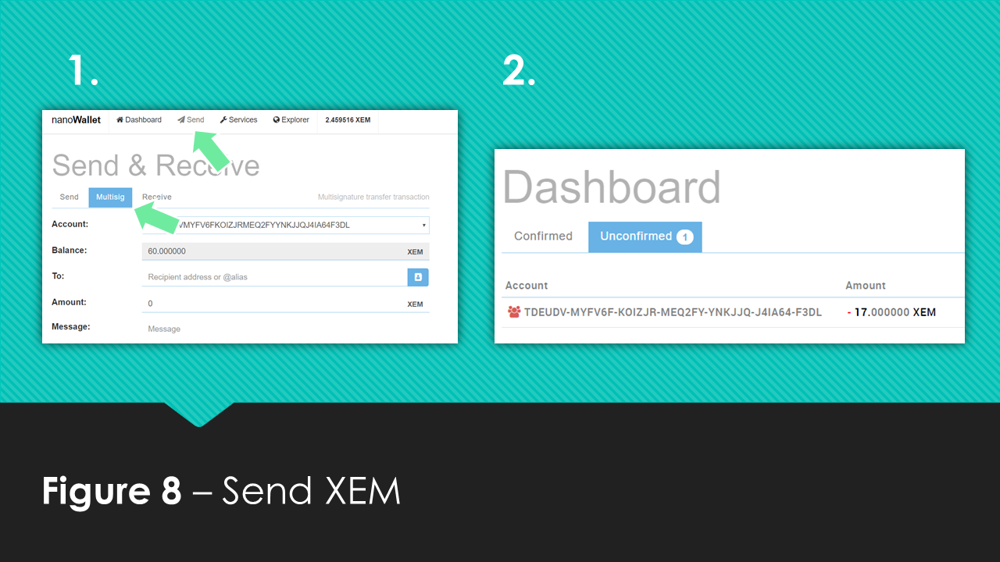
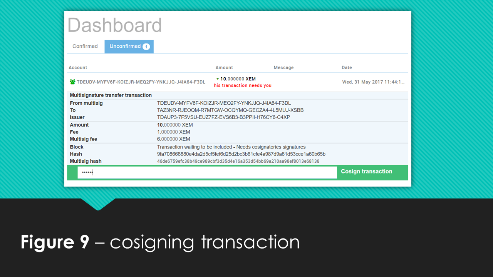

## How to send XEM from a multi-signature Account
Now that you created a multi-signature account we need to use it, what better way than to send some XEM! So the **signer1** account wants to spend some money from the multi-signature account, you can do this by clicking **Send** in the top panel and subsequently by clicking **Multisig**. From the **signer1** account you can fill in the recipient, the amount and click **Send**, as illustrated in Figure 8. 
 

However, as you can see in Figure 9, the Dashboard shows the unconfirmed transaction waiting for approval. Because we constructed the contract such that both **signer1** and **signer2** need to confirm the transaction we need to wait for **signer2** to login to his account and confirm the transaction by cosigning it. **Signer2** can do this by clicking on the **Unconfirmed** tab in his dashboard and then clicking on the transaction waiting for cosigning entering the password and clicking send. 

