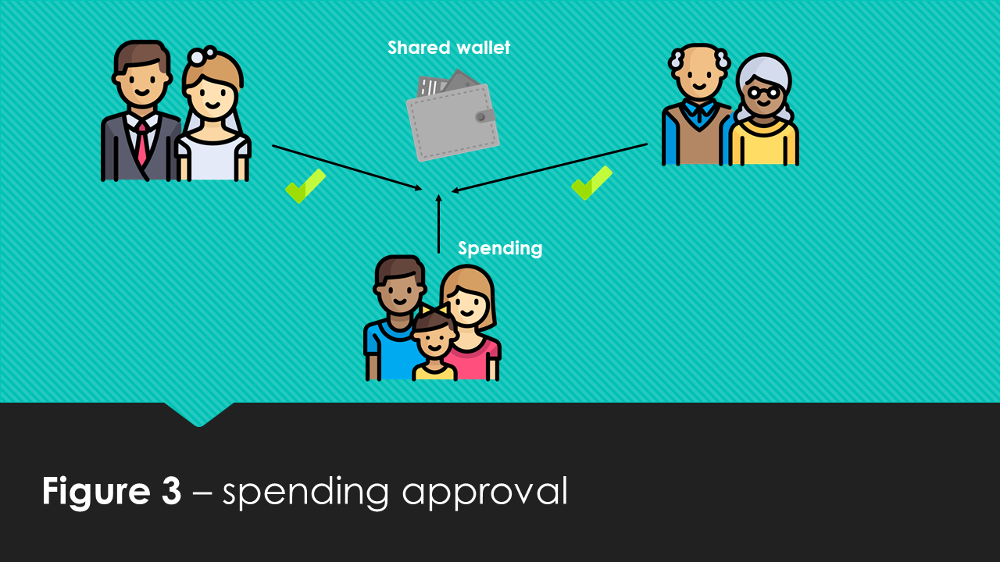
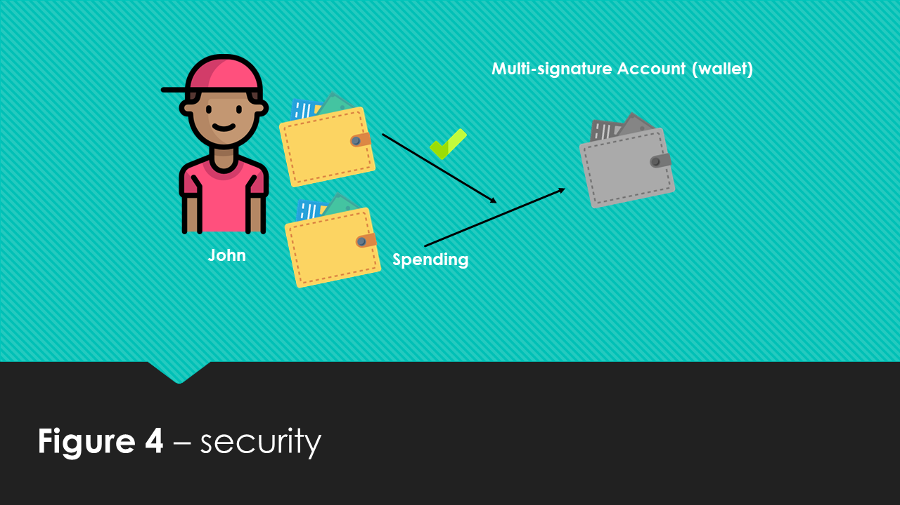

Multi-signature accounts are a powerful tool, but please use this tool with caution, as mistakes can result in the permanent loss of access. 

Some important things to keep in mind:
 
* Once you convert an account to a multi-signature account, you can no longer initiate transactions from that account. All transactions from the multi-signature account must be initiated by one of the cosignatories. This can be thought of as a parent/child relationship.  The account(s) that are signers are parent accounts and the account that has been turned into a multisig account is a child account.  The parent accounts have full custodial control over the child account, and the child account no longer has any control over its funds. 

* NEM's current implementation of multisig is "M-of-N", meaning M can be any number equal to or less than N, i.e., 1-of-4, 2-of-3, 4-of-9, 11-of-12 and so on. NEM also allows "N-of-N" accounts, i.e., 1-of-1, 2-of-2, 5-of-5, 10-of-10 and so on.  With N-of-N accounts transaction have to have all N cosignatories sign the account, but to edit the signers on the account it is "N-1." For example, if you create an account with 3 cosignatories only 2 signers are necessary to delete or change the third signature - hence N-1 (3 being "N" in the above example).

* You can create multi-signature accounts with up to 64 signatories. But beware, if more than 1 key gets lost this would currently result in the permanent loss of access to the funds held by the multi-signature account.

## What is a multi-signature contract?
NEM's multi-signature contracts work out of the box, with a push of a button. They are universal, meaning they are built **into** the blockchain, not on top of the blockchain as in third-party reliant software for Bitcoin’s multisig. This unlocks various advantages and interesting possibilities for the user. But let’s first take a look at what a multi-signature contract is. The contract enables several people to administrate the activity of an account, control assets such as XEM from one account, other mosaics, or create additional contracts such as creating a new token. NEM’s multi-signature feature makes a contract that assigns rights of a certain account to other accounts. This contract can be edited to suit almost any needs. The contract converts a chosen regular account to a special multi-signature account. Now this account cannot send funds on its own, but is bound by the contract and administered according to the contract via designated cosigners. 
 
To illustrate this concept, take a look at Figure 1. Hannah has a NanoWallet account, and John has a NanoWallet account, but due to a multi-signature contract they also have accesses to a multi-signature account and can both use the funds in this account. The contract can be formed in a way such that **either** Hannah or John can separately use funds from the multi-signature account, (this is a multi-user account,) or that they **both** need to approve a transaction, (this is a multisig account.)

## What is the typical use case?
There is a broad range of useful applications for multi-signature contracts and accounts. Let's take a look at some of the common use cases. The first use case is illustrated in Figure 2. Jonathan and Merryann live together, they have their own separate accounts, but they also need a shared account so that if Jonathan is out shopping, he can buy groceries for both him and Merryann. 
 

The next use case is illustrated in Figure 3. Several families are members of the local philatelist society and use a shared account for buying stamps. To ensure that all agree on which old stamps they should buy and for the right price, they use a multi-signature contract such that all members of the society need to approve a transaction before it can be sent and included in the blockchain as a valid transaction. 
 
 
 
Security is another important aspect of multi-signature accounts, let’s look at Figure 4. John wants to make sure his funds are not compromised in any way. Therefore he sets up a multi-signature account with his funds and attaches two accounts (signer accounts) to control his multi-signature account as a form of 2-factor authentication. Both of his signer accounts need to approve the transaction, and his signer accounts are located on different computer platforms with different passwords. This means that even if an evil hacker or virus should compromise one of his accounts, his funds are still kept secure. For even a higher level of security, he could set up 3-factor or even 4-factor authorization and combine them with things like NEM's upcoming integration with [Trezor](https://twitter.com/spudowiar/status/869597547224076289), [NEM 2FA Authenticator](https://medium.com/@aleixmorgadas/nember-experience-56cfa9507f0e) or its air-gapped offline wallet for the highest level of security found on any blockchain. 
 
So now that you know what the common use cases are, we can move on to "how to create & edit these contracts."
 
 