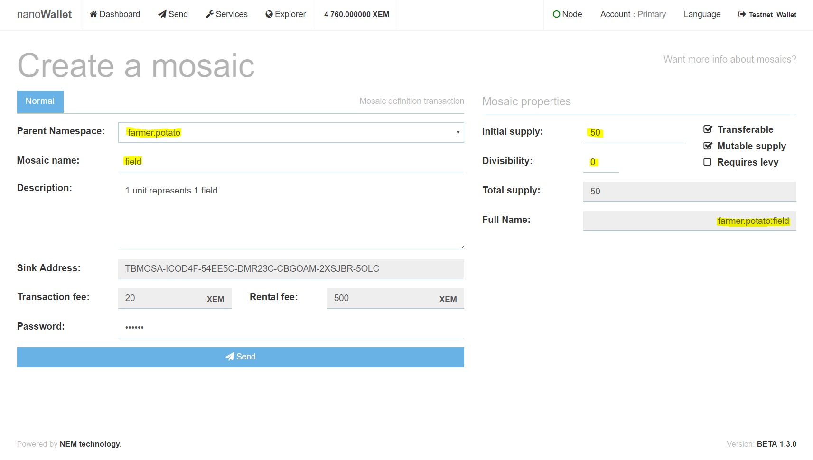
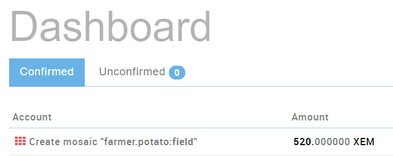

**Mosaic definition**
- Parent Namespace: select "farmer.potato"
- Mosaic name: field (this is the name of the mosaic)
- Description (optional): a short text description 
- Password: Your wallet-password

**Mosaic properties**
- Initial supply: 50 (50 fields)
- Divisibility: 0 (fields are not divisible)
- Transferable: Means, the mosaic is transferable
- Mutable supply: Means, the supply can be changed up or down in the future

## Creating a Mosaic Asset

Once you have entered all the values, click "Send". Go to the Dashboard and check, if the creation was successful.

If you open the "Explorer", you can see that you now own 50 assets of farmer.potato:field

