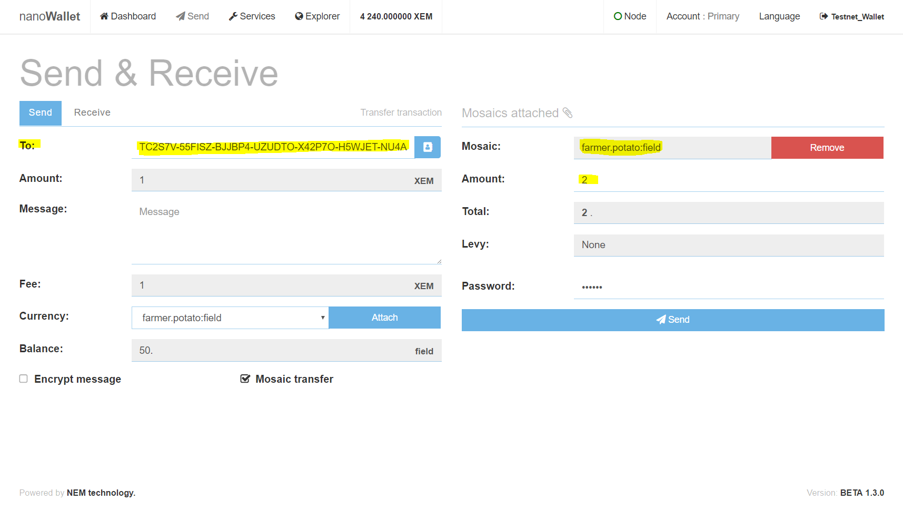
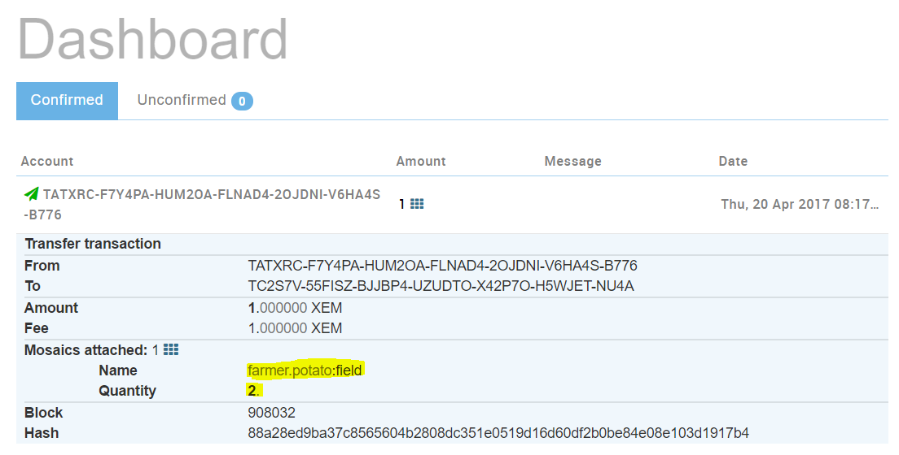
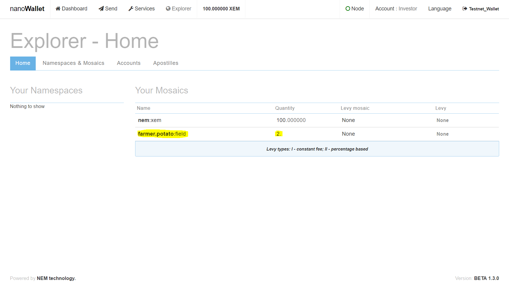

## Transfer of Mosaic
### Introduction
Everything is set up now and you are ready to sell your first field(s) to investors. Since you are using NEM to manage your fields, your investors also need to set up a NEM NanoWallet. Once done, they can send you their account address.

### Transfer (farmers view)
Investor 1 (Alice) has set up the NanoWallet and wants to buy **2 fields** from you. 
The account address from Alice is: TC2S7V-55FISZ-BJJBP4-UZUDTO-X42P7O-H5WJET-NU4A

To send 2 fields to the account, go to Send in NanoWallet and choose "Mosaic transfer":

Remove the "nem:xem" mosaic:

Choose "farmer.potato:field" from the "Currency" dropdown and click "Attach":

Add the account address from Alice in the "To" field. Set the amount for the field(s) on the right side, enter your wallet-password and click "Send":

Once you have sent the mosaic asset(s), go to the Dashboard and check, if the transfer was successful:

### Transfer (investors view)
Alice will see the incoming transactions on her Dashboard:

To check all her owned mosaics, the investor can open the Explorer:

