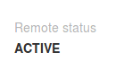

## Activation
Before you can start delegated harvesting, you need to activate it. Consider this to be the same thing as registering on the blockchain that you want to harvest. To do so go to "Services - Manage delegated account" and activate it from the left panel by entering your password and clicking "Send".   

Activation takes ~6 hours and will cost you 6 XEM in fees. **Activation only needs to be done one time per account.**

To check if delegated harvesting is active take a look at the right panel:

"Remote status" will change to active after 6 hours:

Once your "Remote status" is active, you can continue with the next step.
