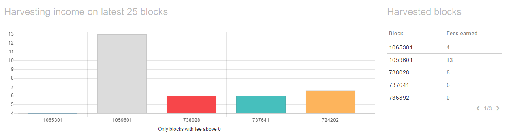

## Start / Stop
Now that the "Remote status" is active you need to wait until "Vested balance" (right next to "Remote status") shows at least 10'000 XEM.

If this is the case, you can start delegated harvesting from the panel below.

Enter your password, choose a node and press on the "play icon" to start it. 

If everything is successful, the "play" icon will change to a "stop" icon.

If you receive an error, it is most likely because the node you selected is already full. Every node only has a certain amount of harvesting slots, and once they are full, you will need to choose another node.

One way of finding another node is to open [supernodes.nem.io](http://supernodes.nem.io) and try different nodes from the provided list. 

Another way to find nodes with free harvesting slots is the @NemNotificationsBot on Telegram. With the command /harvestingSpace it will provide you nodes with free slots. Read more about it [here](https://nem.ghost.io/nem-chain-supernode-notifications-telegram-bot/).

## Review Blocks Created
You can later log in to the Dashboard of your NanoWallet and get a summary of the latest blocks and fees you have collected. 

**Check your NanoWallet from time to time to see if harvesting is still ongoing. If the node you have selected restarts, you also have to start harvesting again! Meaning, as long as the node was on, it will continue to harvest for you for free, but if it reboots, you will have to request it to harvest for you again.**

*The NEM Team would like to thank Patrick (Telegram: @Spizzerb) for contributing this.*