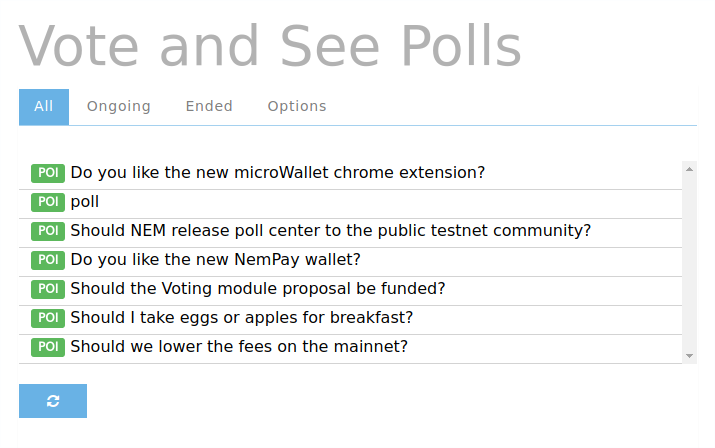

**Voting and Viewing Results**

On the See Polls option you can observe a list of all the polls submitted to the current poll index, which at the start will be the default index. If you click on any of the polls the details of the poll will be loaded from the blockchain and displayed. On the bottom there is a button for refreshing the polls on the index.

**Voting on a Poll**

If everything is correct (you have voting permissions and you have not previously voted) you can send your vote.
If you are cosignatory of a multisig account, you will see a multisig tab, where you can choose from all your multisig accounts and cast a vote for them, which will appear as a multisig transaction to all the cosignatories.
On the options tab you can find a bar where you can input a NEM address pertaining to a poll or a poll index to display them. You can also create a new poll index and see a list of your created poll indexes if you have any.

**Results of a Poll in the Testnet**

You can display the results of the poll by going into the results tab. If the poll is ongoing the results are not definitive since they are checked on the current block, and importance scores are likely to change.
If the poll has ended the results are definitive and are counted from historical data. The counting automatically pulls data from a node that has historical data activated.