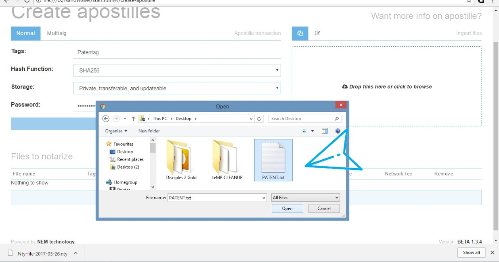
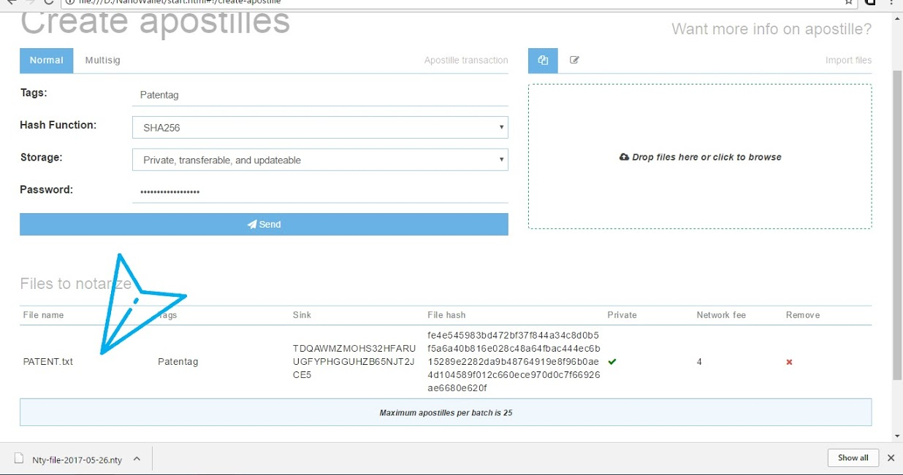
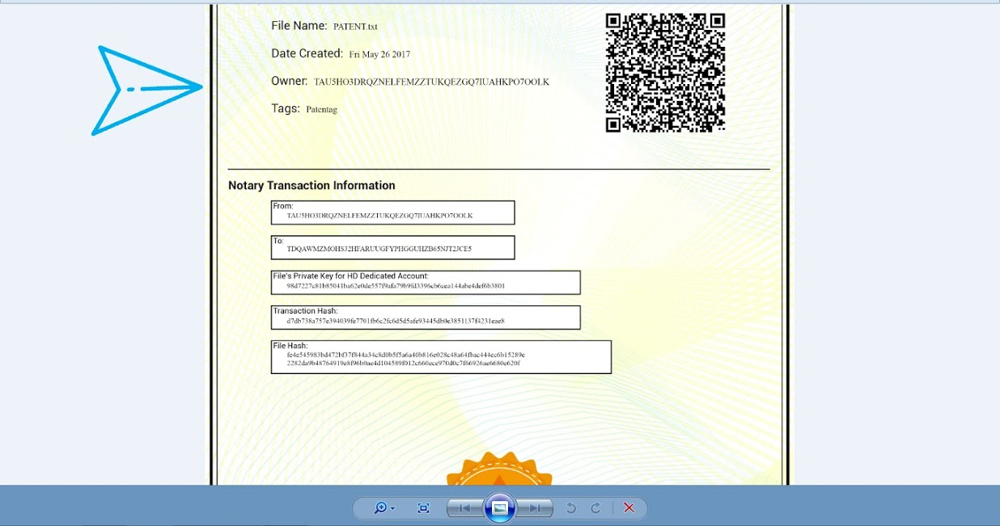

**How to Notarize Files**

Open your NanoWallet and log in and click the **Services** tab.

You will need to enter the password and tags before you can select the files to notarize. Select your encryption (SHA-256 is fine for most cases) and whether you will notarize it privately or in a public sink. We suggest public if you just want a time-stamp of the document and require no extra utility. If you want the document to be updateable and transferrable, select private.

Select a file you want to notarize.

It will show on the list below; check everything and click **send**.

A download will prompt. That is your .zip file containing the Apostille file, notarized certificate and .nty, which is your notarization history.

Your account is stated as both the owner and sender of the Apostille file in the certificate.

