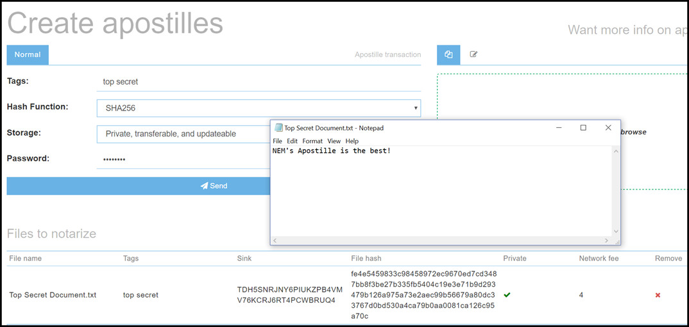
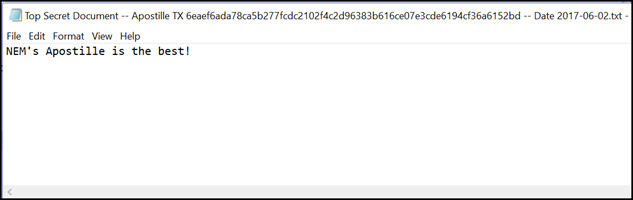
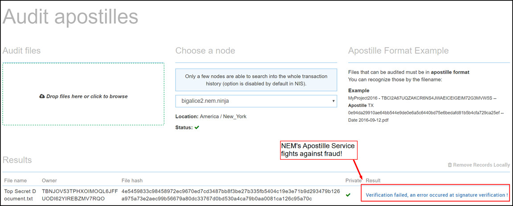

## What if Somebody Tampers with the File?
Here's where Apostille really shows off its innovation and usefulness. Apostille not only creates a timestamp of the document to prove it existed at a certain point in history, it also hashes the contents and signs it with the private key of the creator to maintain the integrity of the content. This is an absolute breakthrough technology as we are now able to prove that a document not only existed at a point in time but also who the owner was and what was contained within that document.

Here's an example of a file that's notarized and then subsequently changed without permission: 

Here are the original contents of the notarized file: 

Lets be sneaky and change the contents without permission and save it, thinking we've gotten away with fraud:

Verification Failed! Apostille says "not today, good sir." Fraud was averted because we were smart and notarized the Top Secret Document before sharing the contents with malicious users. 

If the document was authentic and exactly matched our notarized version we would get the result "File successfully audited!"

