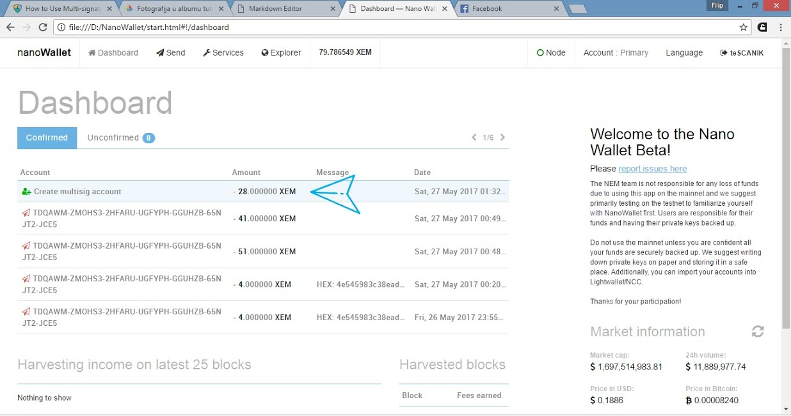
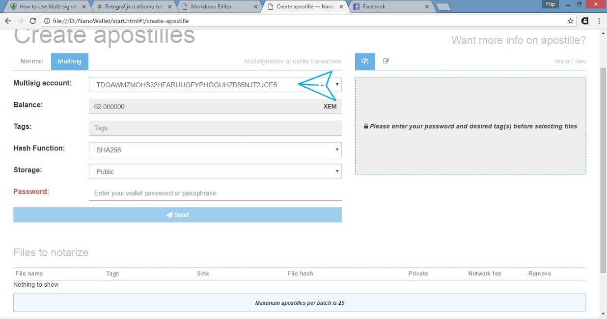

Transferring notarizations is much like making a multisig account. In the Apostille **History** you will find a button for **Transfer or Split Ownership** (see picture above.) There you can add a new co-signer, and if the person is the only co-signer, you will lose ownership over the notarization account that has been generated from your file, effectively transferring it to another person's control.
In my example, I have two cosigners. You can add one or many at a time.

If you add yourself and another account, you have joint ownership. In that case, you can issue transactions only with the approval of the other party if it's a 2-of-n multisig contract (e.g., you set **min signatures** to 2).
If you set **min signatures** to 1, e.g., 1-of-n, then either of the accounts can issue a transaction. This would be a 1-of-2 account - meaning only one person in the pair needs to sign to make a trade.

In the case of 5 people, the **min signatures** can be any number 1 to 5. If you choose 5, there will be a 5-of-5 contract over the Apostille account and 5 cosigners are needed to authorize a transaction.

**Note that the Apostille account needs XEM to pay fees for when it is updated or transferred.**

You will need to send some XEM to the Apostille account. You will need 22 XEM to add one co-signer, or 28 XEM for two, as you can see in my case. (Fees may change.)

Input all required information and click **send**. (See above.)

After the transfer confirmation, the Apostille account is transferred.

Now if you want to make a notarization from a shared account, you can do so in the Apostille **Multisig** tab.
Just select the account from the drop-down list and notarize as before.

Note that this transfer affects only the Apostille of one file, the one that generated the now multisig account. It can be used to update the notarization. Or you can notarize a different file which will generate a new account for it.

