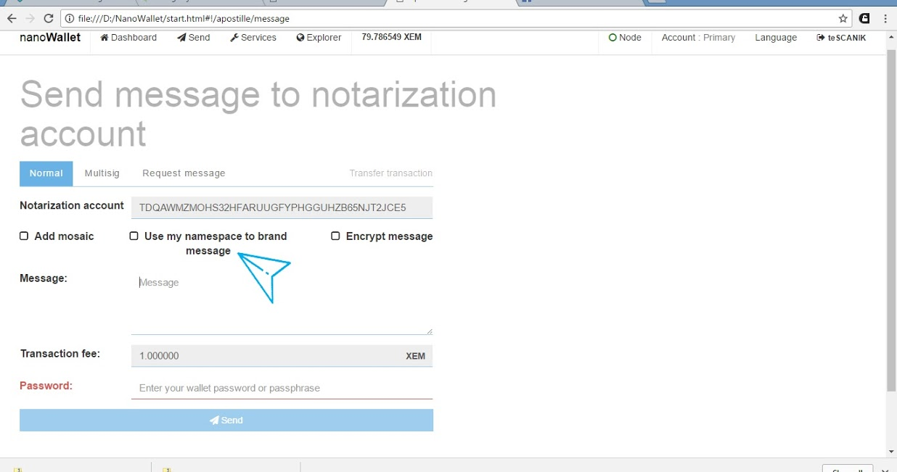

Namespaces can play a major role in maintaining credibility and handling of company documents. With the addition of a namespace and mosaics, the Apostille system becomes even more robust as it allows a sort of watermark on the updates, which provide proof that this update came from the actual company claimed.

Let's say you are a co-signer with your partners. You have a multisig account which owns the NEM namespace "**your.biz**"

You place an announcement on your official website which states that you own "your.biz". Your customers see this announcement and can now be assured that any notarized documents which contain “your.biz” is a legitimate document originating from your company.

Furthermore, if you or your multisig account owns a namespace, you can brand your message for others with account access to view. Another good idea is to create a mosaic under that namespace to be used as proof of originality and send it along with a message, thus verifying the Apostille notarization a second time. Lastly, interested third parties auditing the document and verifying it, may also send messages or mosaics to say that the document has undergone third-party verification.

