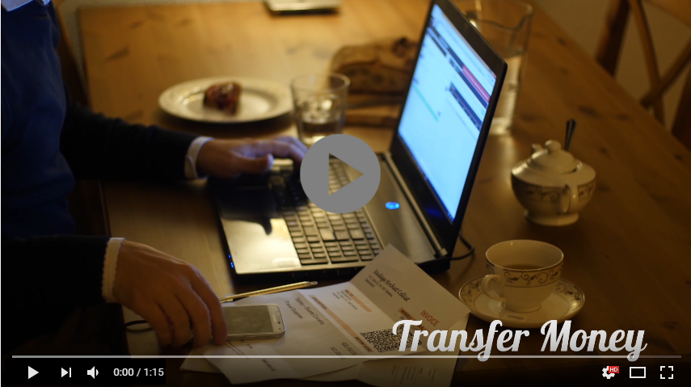

* TOC
{:toc}

The new apps work in conjunction with the recently released [NanoWallet](https://web.archive.org/web/20210814074405/https://forum.nem.io/t/nano-wallet-beta-1-1-11-5-000-xem-bug-bounty/2791). The mobile app allows users to make and scan invoices, export their address book contact, or backup their wallet via QR.  The Android app can serve to work reversely as both a merchant point-of-sale app or a user app. The new apps also work with the Owon's newly released [paper wallet generator](https://drive.google.com/open?id=0B_jImF0AZXu-WkJGdlZkVUYtYTg).  To run it, unzip the folder and click on the Voucher+Paper_Wallet.exe file.

All private and important information is stored locally and never transmitted over the internet.

## Download

The mobile Android version of the Nem wallet is downloadable for the mainnet and the testnet via the [Play Store](https://play.google.com/store/apps/details?id=org.nem.nac.mainnet&hl=en).

## Install and Setup

Just a few seconds after clicking download from the Play store, the app should be installed. Open up the app and you will see a screen just like this:  

Set a secure password for your Nem wallet, it is important to keep your account safe. Every time you open the app, it asks for your password, therefore you shouldn't forget it and make a backup of your password. After setting up a password, it will go to the home page of the app. That looks like this:  

Click on 'Add Account', and a new page will pop up. You will have three options to choose from; those options are: 'Create', 'Scan QR' and 'Enter Key'. It will look like this:

We are going to choose ‘Create a New Account’ since there isn’t one yet. If you already have a Nem wallet on your computer and want to import that wallet, please use the 'Enter Key' option. So when we click on the 'Create' button it brings us to the following page:

As you can see it asks you to give a name to your account. You can have multiple accounts with their corresponding addresses and give each a unique name so you will not get confused which account is which. After naming your account, click on the 'Create' button. Your account will be created, and it will bring you to a page where all your accounts are listed, which looks like this:

## Send a transaction

Now select your wallet that you want to use, this will bring you to your Dashboard.
From your Dashboard you can send XEM to other wallets, you do this by clicking on "New" at the top right corner. Creating a new transaction will look like this:

Simply enter the receiving address, the amount of XEM to send and the fee will be automatically updated. You can also optionally send a message and encrypt that message. Encrypted messages can only be read by the sender and receiver, but regular messages can be read by anybody looking at the blockchain.  After filling in all required forms, hit the *Send* button to execute the transaction.

## Share and Receive

There are multiple ways of sharing your wallet address. The most standard option is just to copy and to paste your wallet address, however, some people make mistakes while copying and pasting. Therefore every XEM wallet has it's own QR code and a QR code scanner, so you can’t make any mistakes when sending or receiving money.

You can save other’s addresses in the Address Book. It is a list of the contact names and their matching addresses, so when you need to send some XEM to one of your contacts, you can simply use the address from the Address Book.

## Multisig

The multisig option is a unique option. Many other blockchain wallets do not have the technology/knowledge to implement this feature as NEM uses multisignature contracts over multisigged accounts. It basically lets you make a normal wallet and then multisig it. At that point, the account has no power and its private key is useless. You then need multiple keys from other singing accounts to send XEM. Any m-of-n combination can be made, meaning 1-of-1, 1-of-2, 2-of-3, 10-of-10, etc. The images below will explain the principle.

*In above picture the private key of the multisigged account is nullified. Alice, Bob, and Chuck have custodial control over Account M.*

*With only a few clicks, Chuck’s account is added and Davie’s account is removed.*  

The best part of NEM's multisig solution is it can be set up by anybody in less than a minute with just a few clicks.  Later, additional accounts can be added or taken away, or the minimum number of signers can be edited with just a few more clicks on the mobile wallet, or any other NEM wallet as multisig is supported across all platforms.

## Harvesting details

If you click on the "More" button that is located at the right bottom of the dashboard, you will see a new screen with a lot of other options.

Three important options are "Harvest Details", "Export Account" and "Multisig". The harvest details will show you how much you XEM you have vested, your POI ratio and your delegated harvesting status.

## Export an account

Finally, the most important option is "Export Account", when you click on it, it opens a screen with three very important things about your wallet. Those three are the QR code of your wallet, your public key and your private key. It is smart to make a backup of your *private key*, since that is the key that gives you access to your funds that are stored in the wallet, so be wise and make multiple backups. Do not save private keys online or other places easily accessed by others.

Good to know: The private key is all you need to access your XEM balance from any other device. There is no XEM kept inside this mobile wallet app, all is **on the NEM blockchain!**
