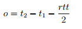

The following has been adapted from the [Technical Report](../../Whitepapers/NEM_techRef.pdf) and is indeed very technical in nature. In summary, it explains how NEM has deployed the first ever time sync P2P network and the formulas for how it works.

After having operated for almost one year on a live network, we are pleased to report that NEM's P2P time sync for nodes has performed well.

## Introduction

Like most other crypto currencies, NEM relies on time stamps for transactions and blocks. Ideally, all nodes in the network should be synchronized with respect to time. Even though most modern operating systems have time synchronization integrated, nodes can still have local clocks that deviate from real time by more than a minute. This causes those nodes to reject valid transactions or blocks, which makes it impossible for them to synchronize with the network.

It is therefore needed to have a synchronization mechanism to ensure all nodes agree on time. There are basically two ways to do this:

1. Use an existing protocol, such as NTP
2. Use a custom protocol

The advantage of using an existing protocol like NTP is that it is easy to implement and the network time will always be near real time. This has the disadvantage that the network relies on servers outside the network.

Using a custom protocol that only relies on the P2P network itself solves this problem, but there is a trade off. It is impossible to guarantee that the network time is always near real time. NEM uses a custom protocol in order to be completely independent from any outside entity.

## Gathering samples

Each node in the network manages an integer number called *offset* which is set to 0 at start. The local system time in milliseconds incremented by the offset (which can be negative) is the network time (again in milliseconds) of the node.

After the start up of a node is completed, the node (hereafter called *local node*) selects up to 20 partner nodes for performing a time synchronization round. Only nodes that expose a minimum importance are considered as partners.

For all selected partners the local node sends out a request asking the partner for its current network time. The local node remembers the network time stamps when the request was sent and when the response was received. Each partner node responds with a sample that contains the time stamp of the arrival of the request and the time stamp of the response. The partner node uses its own network time to create the time stamps.

Using the time stamps, the local node can calculate the round trip time

and then estimate the offset o between the network time used by the two nodes as

This is repeated for every time synchronization partner until the local node has a list of offset estimations.

## Applying filters to remove bad data

There could be bad samples due to various reasons:

- A malicious node can supply incorrect time stamps.

- An honest node can have a clock far from real time without knowing it and without having synchronized yet.

- The round trip time can be highly asymmetric due to internet problems or one of the nodes being very busy. This is known as channel asymmetry and cannot be avoided.

Filters are applied that try to remove the bad samples. The filtering is done in 3 steps:

1. If the response from a partner is not received within an expected time frame (i.e. if\
   t4 - t1 > 1000ms) the sample is discarded.

2. If the calculated offset is not within certain bounds, the sample is discarded. The allowable bounds decrease as a node's uptime increases. When a node first joins the network, it tolerates a high offset in order to adjust to the already existing consensus of network time within the network. As time passes, the node gets less tolerant with respect to reported offsets. This ensures that malicious nodes reporting huge offsets are ignored after some time.

3. The remaining samples are ordered by their offset and then alpha trimmed on both ends. In other words, on both sides a certain portion of the samples is discarded.

## Calculation of the effective offset

The reported offset is weighted with the importance of the boot account of the node reporting the offset. This is done to prevent Sybil attacks.

An attacker that tries to influence the calculated offset by running many nodes with low importances reporting offsets close to the tolerated bound will therefore not have a bigger influence than a single node having the same cumulative importance reporting the same offset. The influence of the attacker will be equal to the influence of the single node on a macro level.

Also, the numbers of samples that are available and the cumulative importance of all partner nodes should be incorporated. Each offset is therefore multiplied with a scaling factor.

Let Ij be the importance of the node reporting the j-th offset oj and *viewSize* be the number of samples divided by the number of nodes that were eligible for the last PoI calculation.

Then the scaling factor used is

This gives the formula for the effective offset *o*

Note that the influence of an account with large importance is artificially limited because the *viewSize* caps the scale. Such an account can raise its influence on a macro level by splitting its NEM into accounts that are not capped. But, doing so will likely decrease its influence on individual partners because the probability that all of its split accounts are chosen as time-sync partners for any single node is low.

## Coupling and threshold

New nodes that just joined the network need to quickly adjust their offset to the already established network time. In contrast, old nodes should behave a lot more rigid in order to not get influenced by malicious nodes or newcomers too much.

In order to enable this, nodes only adjust a portion of the reported effective offset. Nodes multiply the effective offset with a coupling factor to build the final offset. Each node keeps track of the number of time synchronization rounds it has performed.

This is called the node age.

The formula for this coupling factor *c* is:

This ensures that the coupling factor will be 1 for 5 rounds and then decay exponentially to 0.1.

Finally, a node only adds any calculated final offset to its internal offset if the absolute value is above a given threshold (currently set to 75ms). This is effective in preventing slow drifts of the network time due to the communication between nodes having channel asymmetry.