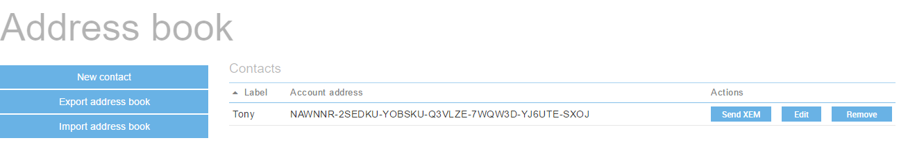

The NEM NanoWallet has a convenient address book feature.

Click on the Services tab at the top of the page, then scroll down to find the address book link and open it.

Here you can add names and addresses of parties with whom you frequently transact. You can also export and import address books for use in other wallets.

To export an address book, press the export button. A window will appear allowing you to save your address book as a .adb file. Save it to your computer. You can copy it or move it to a new location.

To import a saved address book, press the import button and navigate to the saved .adb file you want to import.
