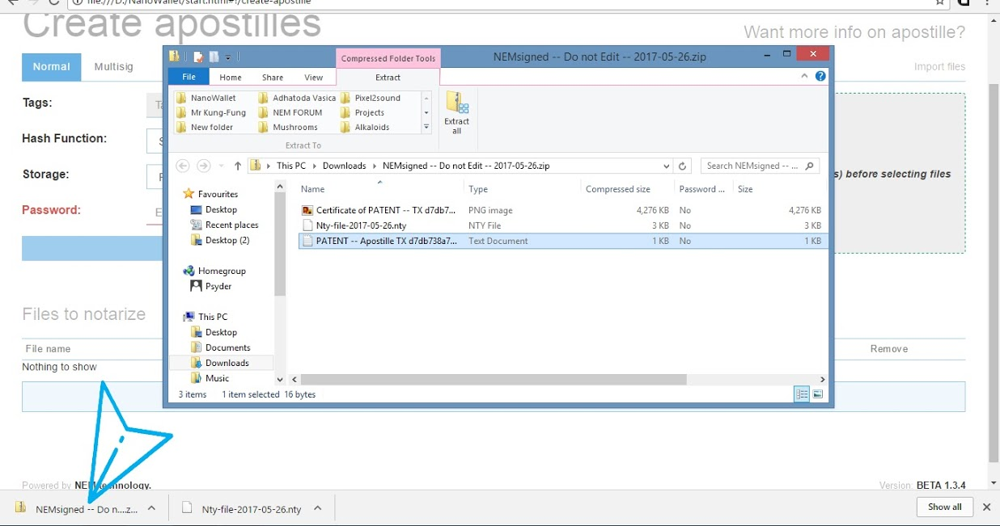
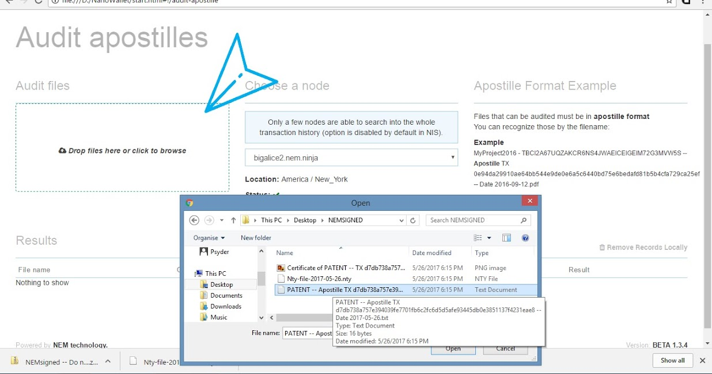
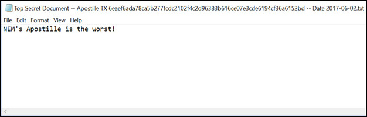
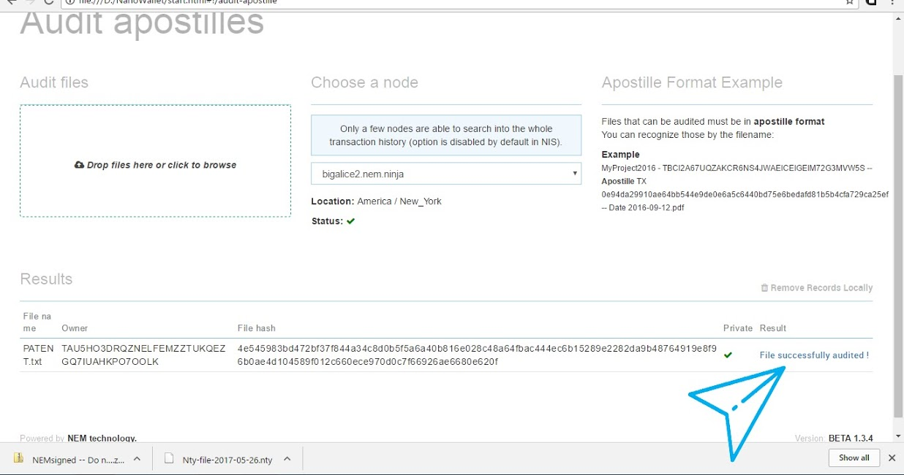
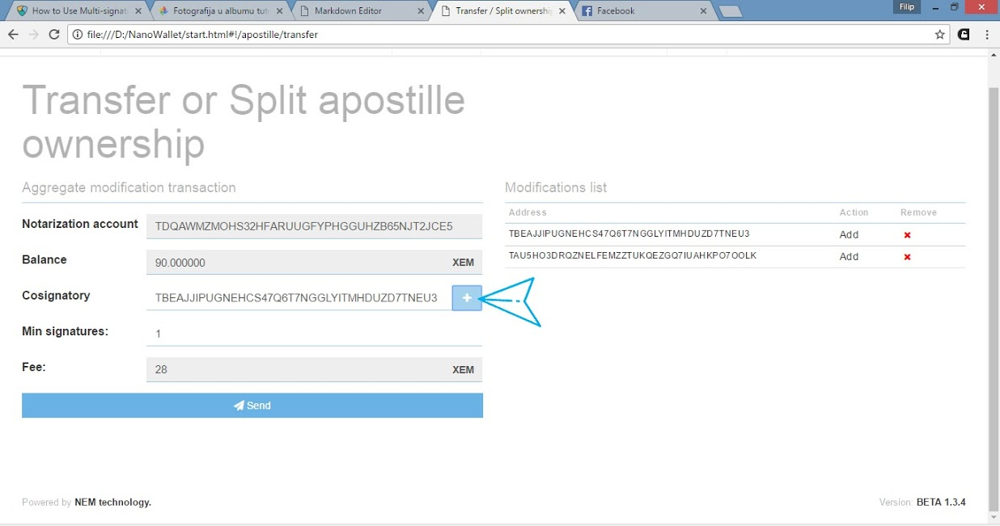

* TOC
{:toc}

## Introduction

NEM's Apostille service is used for notarizing and checking the authenticity of files notarized on the NEM blockchain. Its uses are various, but one big one is to register important documents that need a certificate of origin and content. NEM provides these in a .zip file after a successful notarization, containing a .pdf of the certificate (apostille) along with the original file with a hash in its filename and updated .nty file which is your notarization history.

Apostille allows you to permanently record any document in the blockchain with a timestamp and proof of ownership. This proves you owned that intellectual property on a certain date. It also allows you to compare any future versions of your document and instantly detect whether any changes have been made.

It's easiest to learn from examples so I would like to start with one of many possible uses of the NEM Apostille service.

### The Problem with the Old System

The notary services in the real world, like a notary public verification, are highly useful for providing independent verification of important documents. Having a document notarized with a notary public's seal is the same as swearing under oath in court -- you're attesting that the facts contained in the document are true.

### What is Traditionally Needed for a Document to be Notarized?

To have a document marked with the notary public seal, you'll need to do the following: 

* Show two pieces of identification (government issued photo ID and another one with at least your name.) 
* Verbal agreement in front of the Notary that you understand and can attest to the facts of the document .
* Sign the document with the Notary as a witness.
* The Notary will then affix their stamp to the document.
* The document is now notarized

### Is There a Better Way?

At a fundamental level, what's really needed for a document to be notarized? 

* Irrefutable proof that you are who you say you are (government backed ID.)
* An independent and trusted third party to witness your signature (government backed notary service.)
* A stamp of approval by the third party.

If you think about how a Notary Service works, it seems silly that this is the best we can do to verify important documents in the age of digital documents. Each notarized document charges a significant fee, and the cumbersome task of physically getting it notarized is burdensome. However, until recently it was very difficult to have something verified by an independent third party in the digital space.

### Enter the Blockchain

Bitcoin ushered in the breakthrough technology of the blockchain. The problem for many years was to establish trust between two parties without an independent, reputable third party present. This was a roadblock for many industries and there was always a need to have a centralized middleman, extracting fees for their service as a witness (think Uber, AirBnB, Notary services.)

One of the core functionalities of the blockchain is historical immutability -- the inability to change past records once verified. This breakthrough solution in the digital space has immense value and it's beginning to propagate across many industries.

### The Apostille Way

Apostille is a more robust notarization service built on top of NEM's blockchain. Apostille seeks to provide all of the functionalities inherent in traditional notary services, which includes verifiability, transferability, and updatability, by taking advantage of NEM's naming service, multi-signature accounts, messaging and blockchain assets (mosaics.) With Apostille on NEM, new 2.0 notarizations are possible that provide far more feature and functionality than anything before. Now notarizations are not just one-off timestamps, but instead become proof of notarizations that are updatable, brandable, contain third party memos and verifications, and can even be transferable. The result is an ever-changing notarization to reflect the ever-changing real world.

### Why Notarize Files?

**Use Case: Patent**:
You are an inventor, and you are discussing financing terms about your patent application with third parties. Each of them requires a technical draft, but you’re concerned about idea theft. You sign some confidentiality agreements, but you’re still wary that these third parties can find a loophole to ransack your patent. You want something ironclad to prove that the exact specifications of your idea existed at a certain point in time. You turn to the NEM blockchain to use their Notary 2.0 service, Apostille. You notarize the PDF draft and embed in it the facts pertaining to your ownership of this idea, the confidentiality agreement between you and your parties, your technical specifications, and anything else that you believe will help you should somebody try to steal your idea.

By submitting these items to NEM’s Apostille, you have just recorded the state of the file (the original patent specifications), its timestamp, your name as the owner, and perhaps other co-signers to attest to the validity of the information. You can now have full confidence that this information is forever stamped onto NEM’s blockchain with all of the provided information, and you now have irrefutable proof that you were indeed the owner of this exact document at that point in time.

Now, if your malicious third parties were to edit this file that you sent them in any way, NEM’s Apostille audit service will know, and the file will fail the audit check.

As long as you hold the first notarization of the file and the file itself to audit it, you have absolute proof of ownership.

## How to Notarize Files

Open your NanoWallet and log in and click the **Services** tab.

You will need to enter the password and tags before you can select the files to notarize. Select your encryption (SHA-256 is fine for most cases) and whether you will notarize it privately or in a public sink. We suggest public if you just want a time-stamp of the document and require no extra utility. If you want the document to be updateable and transferrable, select private.

Select a file you want to notarize.

It will show on the list below; check everything and click **send**.

A download will prompt. That is your .zip file containing the Apostille file, notarized certificate and .nty, which is your notarization history.

Your account is stated as both the owner and sender of the Apostille file in the certificate.

## How to Audit Files

Use auditing to check whether a file is different from your notarized version. This lets you know whether a given copy of your notarized file has been modified in any way.

Now that you have your file or/and another file that needs to be audited (checked for authenticity) once again make a visit to the Services tab in your NanoWallet and click on Audit Apostille.

There you will find a box where you can drag and drop any file in the Apostille format. We will be using our "patent" example from the last page. 

As you can see the file was successfully audited, and anyone can trust that the contents have not been modified.

## What if Somebody Tampers with the File?

Here's where Apostille really shows off its innovation and usefulness. Apostille not only creates a timestamp of the document to prove it existed at a certain point in history, it also hashes the contents and signs it with the private key of the creator to maintain the integrity of the content. This is an absolute breakthrough technology as we are now able to prove that a document not only existed at a point in time but also who the owner was and what was contained within that document.

Here's an example of a file that's notarized and then subsequently changed without permission:

Here are the original contents of the notarized file:

Lets be sneaky and change the contents without permission and save it, thinking we've gotten away with fraud:

Verification Failed! Apostille says "not today, good sir." Fraud was averted because we were smart and notarized the Top Secret Document before sharing the contents with malicious users.

If the document was authentic and exactly matched our notarized version we would get the result "File successfully audited!"

## How to Update Notarizations

With the previous example, it's clear that tampering with a file's content will cause it to fail the content's hash check when we try to verify it on Apostille. This is an amazing security feature that protects against unauthorized edits to a file. However, **authorized** updates by the owner (or group of owners) to a document are possible, and they leave a transparent audit trail.

The file below was modified as you can see from its date and does not pass an audit.
It's my file from before, and I need to update the changes...

On the Services page select Apostille History and you should find your document there along with the Update button. Note that there are two publicly notarized files, which don't have any buttons. The reason for this is because these files were publicly notarized and transferred to a public sync account so they cannot be updated or transferred.

Enter your password and upload a new version of the file with the original filename. You will be prompted to download your updated Apostille.

If you go to your Apostille history again, you will see the updated notarization on top of the list, with a new file hash.

## Transferring notarizations

Transferring notarizations is much like making a multisig account. In the Apostille **History** you will find a button for **Transfer or Split Ownership** (see picture above.) There you can add a new co-signer, and if the person is the only co-signer, you will lose ownership over the notarization account that has been generated from your file, effectively transferring it to another person's control.
In my example, I have two cosigners. You can add one or many at a time.

If you add yourself and another account, you have joint ownership. In that case, you can issue transactions only with the approval of the other party if it's a 2-of-n multisig contract (e.g., you set **min signatures** to 2).
If you set **min signatures** to 1, e.g., 1-of-n, then either of the accounts can issue a transaction. This would be a 1-of-2 account - meaning only one person in the pair needs to sign to make a trade.

In the case of 5 people, the **min signatures** can be any number 1 to 5. If you choose 5, there will be a 5-of-5 contract over the Apostille account and 5 cosigners are needed to authorize a transaction.

**Note that the Apostille account needs XEM to pay fees for when it is updated or transferred.**

You will need to send some XEM to the Apostille account. You will need 22 XEM to add one co-signer, or 28 XEM for two, as you can see in my case. (Fees may change.)

Input all required information and click **send**. (See above.)

After the transfer confirmation, the Apostille account is transferred.

Now if you want to make a notarization from a shared account, you can do so in the Apostille **Multisig** tab.
Just select the account from the drop-down list and notarize as before.

Note that this transfer affects only the Apostille of one file, the one that generated the now multisig account. It can be used to update the notarization. Or you can notarize a different file which will generate a new account for it.

## Multisig notarizations

**Use Case: Two-Party Contract**:
Sometimes there is a need for an extra layer of authorization. This is where an already existing multisig account comes into play.

Let's say you just signed a contract in Singapore. Your business is based in the UK, and you want to make a digital archive of that contract. However, you are not the sole business owner, and others are required to authorize it before archiving the contract. So you send them all a copy of the file to review, preferably notarized with Apostille. If you all agree that this is the file you want to archive, you will use the company multisig account to send a joint notarization.

You can do that by following these simple steps:

Go to **Create** Apostille in the **Services** tab; I also highlighted some small icons on the right. The first “Normal” button lets you upload a file to notarize as outlined above. The other “Multisig” button opens the fields as shown below.
There you can enter the name of a text document and its contents. 
NEM Apostille will make a notarized one for you. Then it will prompt to download a .zip file download.
It's quite useful for making documents on the go.
Now, please take a moment to find the **Multisig** tab just below the title "Create Apostilles."

Click on it and you will navigate to this page. Here, the procedure of notarizing a document is almost the same, except you choose a multisig account to do the signing. Note the multisig account pays the fees. If there were more signers, each of them would also pay additional transfer fees from the notarization account.

All co-signatory rules apply in this transaction also.

When you click send, the cosigners will get a request to authorize the transaction. When the transaction is initiated, the download will prompt.

I have compared certificates signed by my account (on the right) and signed by a multisig (on the left.)

The owner is the same, the one that issued the transaction but not the **sender** account of the notarization. This is because regardless of which account is paying the fees, the person initiating must have been an owner or at least part owner to initiate.

_The document will always be signed using a private key from the uploader's account, even when signing with multisig. In this way, you establish the source account and original owner of the document._

In the example on the right, we can see that "from:" field contains a multisig account address.

If you were to go to a blockchain explorer and search for that account, you would see its co-signers if any.

Also when you audit an Apostille, you can find it on the explorer by clicking on **"File successfully audited."**

There you can find the sender account and cosigners of the multisig account if it was issued from one.

## Use of namespaces

Namespaces can play a major role in maintaining credibility and handling of company documents. With the addition of a namespace and mosaics, the Apostille system becomes even more robust as it allows a sort of watermark on the updates, which provide proof that this update came from the actual company claimed.

Let's say you are a co-signer with your partners. You have a multisig account which owns the NEM namespace "**your.biz**"

You place an announcement on your official website which states that you own "your.biz". Your customers see this announcement and can now be assured that any notarized documents which contain “your.biz” is a legitimate document originating from your company.

Furthermore, if you or your multisig account owns a namespace, you can brand your message for others with account access to view. Another good idea is to create a mosaic under that namespace to be used as proof of originality and send it along with a message, thus verifying the Apostille notarization a second time. Lastly, interested third parties auditing the document and verifying it, may also send messages or mosaics to say that the document has undergone third-party verification.

## Last words

Coming full circle, I hope you can understand how NEM’s Apostille can be utilized to provide irrefutable proof of any asset’s existence. Combine this with unique namespaces, multi-signature authorizations, updateable and transferable options, and you can begin to see just how useful and potentially revolutionary Apostille can be.
Keep in mind that Apostille is still in development and will continue to deliver more customizations and features over time. The system is highly adaptable and additional functions can be added through modules from third-party developers as well. To conclude this tutorial, here is a little list of possible use cases for the Apostille service. There is already at least one major company who’s currently utilizing this service, [LuxTag](http://luxtag.io/).

* Archiving sensitive data or documents which require immutability and should not be tampered with.

* Proof-of-ownership for an original document.

* You could notarize a certificate of ownership for your assets such as vehicle repairs, maintenance, accidents, permits, and ect., sent as a message to the account, where it could represent the current state of your asset with sequential updates. If you sell your asset, you can transfer ownership of notarization account to the new owner of the asset.

* Regarding digital media licenses, namespace and digital assets can originate from the notarization account for the license and these assets can be sent to others representing rights in the license.

* Companies with luxury goods can make a namespace account that only they can control. They can publish this name on their business profile. They can then make a blockchain notarization for each and every item using things like serial numbers, high definition scans, chemical makeup, and so on, to identify and register each item uniquely. Since each item is unique, and each is fingerprinted, and each blockchain notarization comes from a registered and recognized source, any competitor offering counterfeit products without an accompanying blockchain notarization will be easily identified.

* Making on-chain notarizations of contracts signed by multiple parties which can then later be updated or transferred if desired.

* Adding concert tickets to an account and verifying that it hasn't been used before re-selling on a marketplace

And finally for a more in-depth technical description, please take a look at the [Apostille Whitepaper](../../../Whitepapers/ApostilleWhitePaper.pdf).
