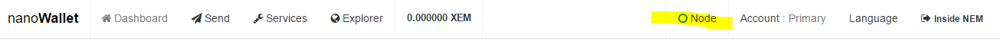
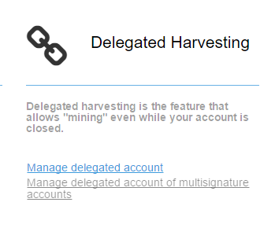
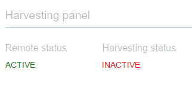

## Red Node

When you log in, check the top right side of the screen to make sure the node indicator is green.

If it is red, you are no longer connected to a blockchain node and you will need to connect to a new one. If this is the case, you may not see your account balance displayed.

Click on the node indicator (highlighted in yellow) to bring up the Nodes list window.

Click on the "Select a node" drop-down and pick any node listed. Close the window and wait a few seconds. If the node indicator at the top of the screen turns green, you are now connected and you should see your account balance listed correctly. If not, try again with another node.

## Harvesting no longer active

It's a good idea to check on your harvesting status regularly. If the supernode you are connected to shuts down or restarts you probably need to reconnect. 

Click on the Services tab and open the Manage Delegated Account link.

Check your status on the Harvesting panel. If it's Inactive you need to reconnect.
**Also note, you need 10,000 vested XEM in your account to harvest. If you are unsure, read the Delegated Harvesting section.**

Go to the Start/stop delegated harvesting panel on the Delegated Harvesting screen. Enter your password and open the list of supernodes.

It doesn't matter whether you choose one you previously used or a new supernode. If it says "No open slots" you may have to keep trying new supernodes until you find one with an opening.

Press Start Delegated Harvesting and wait a few seconds.

You should now see the Harvesting Panel at the top of the screen with green Active indicators.

