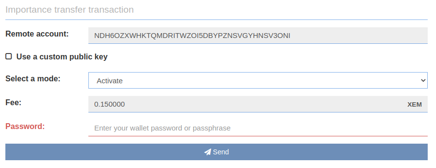
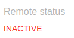
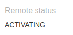
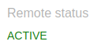
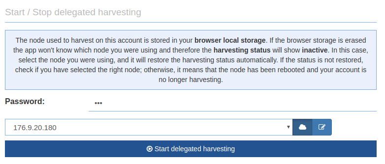
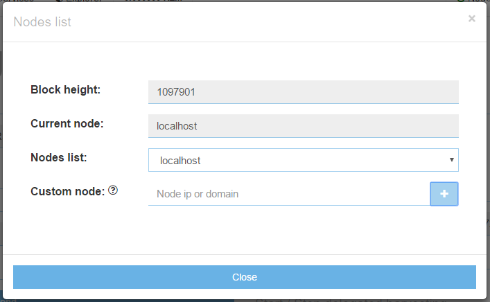

* TOC
{:toc}

On this page you will learn how to activate and start delegated harvesting in NanoWallet. Additionally, you will learn two approaches for harvesting: delegated harvesting on a remote server provided by somebody else, and delegated harvesting by running a local NEM node yourself.

**To activate and start delegated harvesting in NEM NanoWallet you need XEM account with at least a 10,000 XEM vested balance.**

"Vested" means the XEM have stayed in your account for a certain number of days. Every day 10% of your UNVESTED coins become vested. This means an account with 20,000 XEM will take about a week to accumulate the 10,000 vested XEM needed for harvesting.

## Activation

Before you can start delegated harvesting, you need to activate it. Consider this to be the same thing as registering on the blockchain that you want to harvest. To do so go to "Services - Manage delegated account", choose "Activate/Deactivate the delegated account" and activate it from the right panel by entering your password and clicking "Send".

Activation takes ~6 hours and will cost you 0.15 XEM in fees. **Activation only needs to be done one time per account.**

To check if delegated harvesting is active take a look at the left panel:

"Remote status" will change to "Activating" after the transaction confirmation:

"Remote status" will change to active after 6 hours:

Once your "Remote status" is active, you can continue with the next step.

## Start / Stop

Now that the "Remote status" is active you need to wait until "Vested balance" (right next to "Remote status") shows at least 10'000 XEM.

If this is the case, you can start delegated harvesting from the panel available after clicking "Start/Stop delegated harvesting".

Enter your password, choose a node and press on the "Start delegated harvesting" button to start it. 

If everything is successful, the "Start delegated harvesting" button text will change to a "Stop delegated harvesting".

If you receive an error, it is most likely because the node you selected is already full. Every node only has a certain amount of harvesting slots, and once they are full, you will need to choose another node.

One way of finding another node is to open [nem.io/supernode](https://nem.io/supernode) and try different nodes from the provided list.

## Review Blocks Created

You can later log in to the Dashboard of your NEM NanoWallet and get a summary of the latest blocks and fees you have collected.

**Check your NEM NanoWallet from time to time to see if harvesting is still ongoing. If the node you have selected restarts, you also have to start harvesting again! Meaning, as long as the node was on, it will continue to harvest for you for free, but if it reboots, you will have to request it to harvest for you again.**

*The NEM Team would like to thank Patrick (Telegram: @Spizzerb) for contributing this.*

## Local NEM Node

Above we showed how to harvest on a remote node, and it is a normal case for many that they run delegated harvesting on a remote node, but it is also possible to run delegated harvesting on a local NEM node. The advantage of this is that you will always know that your account is being harvested on and you won't have to rely on others.

To set up NEM node check guide: https://nemproject.github.io/nem-docs/pages/Guides/node-operation/docs.en.html

When NEM node is synced click on the "Node" option in the top bar of your NEM NanoWallet and enter "localhost" in the "Custom node" field:

Click "+" to select localhost. It should look like this:

After that close the node settings.
You are now connected to your local NIS!

**Remember to let NIS run in the background!**

To start delegated harvesting with your local NEM node repeat the steps from above but select "localhost" in the "Start/Stop delegated harvesting" panel for your node.

## Benefits of Delegated Harvesting

Delegated harvesting has many benefits for users and most importantly, for the NEM ecosystem.

First, delegated harvesting allows NEM to use a tiered architecture. The first tier is supernodes. Supernodes do the heavy lifting of creating blocks and confirming transactions. The next tier is light clients, such as the NEM NanoWallet. NEM NanoWallet users can collect harvesting rewards without downloading the entire blockchain, and continue to collect rewards even while their computers are off.

Another advantage of delegated harvesting is that it enables a high proportion of users to participate in the Proof of Importance (POI) system. The POI system rewards users for keeping a certain amount of currency in their wallet over time, but also for making frequent transactions. Both of these behaviors are good for the ecosystem, and delegated harvesting is the main reason users want to increase their POI scores.

Harvesters collect 100% of the transaction fees in the blocks they harvest.

One more benefit of NEM's delegated harvesting feature is that light clients use a public key, which means a harvester's private key is never exposed. Even if the Supernode became compromised it would pose no danger to the clients harvesting with it.

Finally, delegated harvesting is a great example of the spirit in which NEM was founded. Instead of rewarding those with huge bankrolls for buying hardware farms or hoarding coins, delegated harvesting allows more people to participate in the reward system. This is part of NEM's culture of fairness and inclusiveness, where anyone can have a positive impact.
