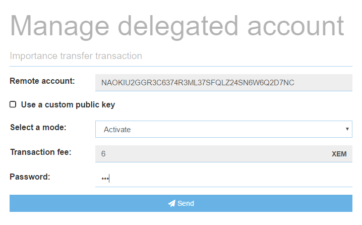
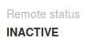
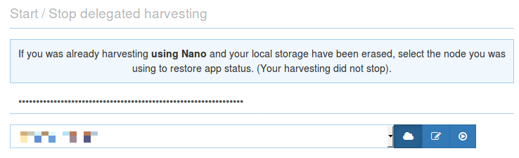
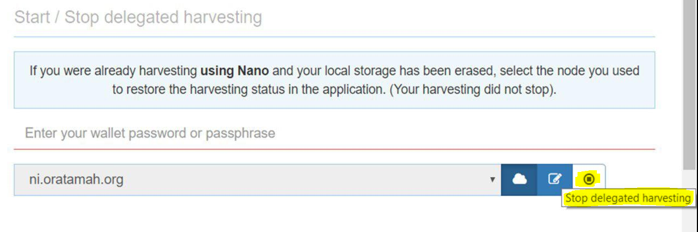
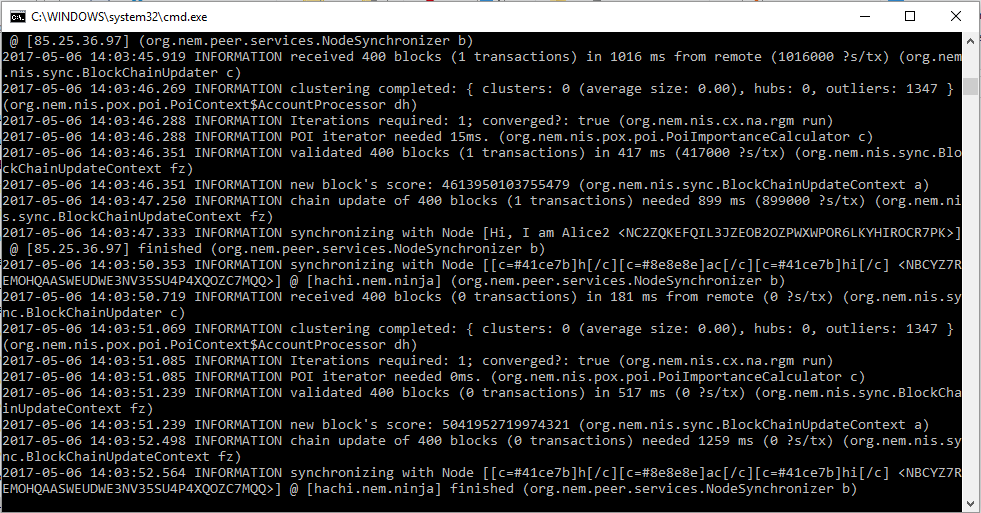
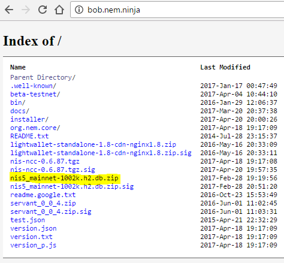
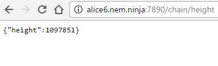

* TOC
{:toc}

You will learn how to activate and start delegated harvesting in NanoWallet. Additionally, you will learn two ways for harvesting.  These are delegated harvesting on a remote server provided by somebody else, or learning how to use delegated harvesting by running a local NIS yourself.

**To activate and start delegated harvesting in NanoWallet you need a [XEM Account](https://nem.ghost.io/how-do-i-get-importance-on-the-nem-blockchain/) with at least a 10,000 XEM vested balance.**

"Vested" means the XEM have stayed in your account for a certain number of days. Every day 10% of your UNVESTED coins become vested. This means an account with 20,000 XEM will take about a week to accumulate the 10,000 vested XEM needed for harvesting.

## Activation

Before you can start delegated harvesting, you need to activate it. Consider this to be the same thing as registering on the blockchain that you want to harvest. To do so go to "Services - Manage delegated account" and activate it from the left panel by entering your password and clicking "Send".

Activation takes ~6 hours and will cost you 6 XEM in fees. **Activation only needs to be done one time per account.**

To check if delegated harvesting is active take a look at the right panel:

"Remote status" will change to active after 6 hours:

Once your "Remote status" is active, you can continue with the next step.

## Start / Stop

Now that the "Remote status" is active you need to wait until "Vested balance" (right next to "Remote status") shows at least 10'000 XEM.

If this is the case, you can start delegated harvesting from the panel below.

Enter your password, choose a node and press on the "play icon" to start it. 

If everything is successful, the "play" icon will change to a "stop" icon.

If you receive an error, it is most likely because the node you selected is already full. Every node only has a certain amount of harvesting slots, and once they are full, you will need to choose another node.

One way of finding another node is to open [supernodes.nem.io](http://supernodes.nem.io) and try different nodes from the provided list.

Another way to find nodes with free harvesting slots is the @NemNotificationsBot on Telegram. With the command /harvestingSpace it will provide you nodes with free slots. Read more about it [here](https://nem.ghost.io/nem-chain-supernode-notifications-telegram-bot/).

## Review Blocks Created

You can later log in to the Dashboard of your NanoWallet and get a summary of the latest blocks and fees you have collected.

**Check your NanoWallet from time to time to see if harvesting is still ongoing. If the node you have selected restarts, you also have to start harvesting again! Meaning, as long as the node was on, it will continue to harvest for you for free, but if it reboots, you will have to request it to harvest for you again.**

*The NEM Team would like to thank Patrick (Telegram: @Spizzerb) for contributing this.*

## Local NIS

Above we showed how to harvest on a remote node, and it is a normal case for many that they run delegated harvesting on a remote NIS, but it is also possible to run delegated harvesting on a local NIS. The advantage of this is that you will always know that your account is being harvested on and you won't have to rely on others.

**NIS needs Java 8 64 bit to run. Download it from [java.com](https://www.java.com/en/download/manual.jsp) and install it with default values.**

To run a local node, [download the standalone client](http://bob.nem.ninja/nis-0.6.97.tgz) and extract it.

In the extracted folder (nis-ncc) you will find a file called "runNis" (Windows: runNis.bat, OSX/Linux: nix.runNis.sh).

* Windows: Execute the file by double-clicking it.
* OSX/Linux: Open a terminal, navigate to the folder "nis-ncc" and execute "nix.runNis.sh"

Once NIS runs, let it run for 1-2 minutes and stop it. We do this to let NIS create the needed folder structure.
Navigate to the created folder structure.

* Windows: C:\users\username\nem\nis\data
* OSX/Linux: username/nem/nis/data

Delete both files (NIS needs to be stopped to delete the files).
Navigate to [bob.nem.ninja](http://bob.nem.ninja) and download the DB file. We do this to speed up the initial sync of NIS.

After the download completes, extract the file "nis5_mainnet.h2.db" and place it in the folder from above.

Once you have done this, start NIS again with "runNis" and let it run in the background. NIS will now finish syncing.

To check if it is synced, you can open [alice6.nem.ninja:7890/chain/height](http://alice6.nem.ninja:7890/chain/height) in a web browser.

Open [localhost:7890/chain/height](http://localhost:7890/chain/height) in another web browser window to compare the block height to alice6 (localhost needs to be **at least** at the same block height as alice6).

When NIS is synced click on the "Node" option in the top bar of your NanoWallet and enter "localhost" in the "Custom node" field:

Click "+" to select localhost. It should look like this:

After that close the node settings.
You are now connected to your local NIS!

**Remember to let NIS run in the background!**

To start delegated harvesting with your local NIS repeat the steps from above but select "localhost" in the "Start/Stop delegated harvesting" panel for your node.

## Benefits of Delegated Harvesting

Delegated harvesting has many benefits for users and most importantly, for the NEM ecosystem.

First, delegated harvesting allows NEM to use a tiered architecture. The first tier is supernodes. Supernodes do the heavy lifting of creating blocks and confirming transactions. The next tier is light clients, such as the NanoWallet. NanoWallet users can collect harvesting rewards without downloading the entire blockchain, and continue to collect rewards even while their computers are off.

Another advantage of delegated harvesting is that it enables a high proportion of users to participate in the Proof of Importance (POI) system. The POI system rewards users for keeping a certain amount of currency in their wallet over time, but also for making frequent transactions. Both of these behaviors are good for the ecosystem, and delegated harvesting is the main reason users want to increase their POI scores.

Harvesters collect transaction fees from the blocks they harvest, and NEM does not take a cut for themselves. Harvesters keep 100% of their catch.

One more benefit of NEM's delegated harvesting feature is that light clients use a public key, which means a harvester's private key is never exposed. Even if the Supernode became compromised it would pose no danger to the clients harvesting with it.

Finally, delegated harvesting is a great example of the spirit in which NEM was founded. Instead of rewarding those with a huge bankroll to buy hardware farms or hoard coins, delegated harvesting allows more people to participate in the reward system. This is part of NEM's culture of fairness and inclusiveness, where anyone can have a positive impact.
