## Introduction

The Ledger Nano S and X are hardware wallets that support multiple cryptocurrencies, including NEM.

A hardware wallet is a type of cryptocurrency wallet where you can store your private keys on a physical device. 
It's a secure and simultaneously user-friendly way to access your coins, as the private key is stored on the device and doesn't get leaked.
Your coins are safe even when connected to an infected or malicious computer or a phishing/scam web page.

NEM Wallet for Desktop allows you to send and receive NEM assets using a Ledger hardware wallet. Along with providing support for XEM, the Ledger device can also offer support for tokens created on the NEM blockchain.

## Prerequisites

1. Your Ledger device has been initialized. Select and click your model below for instructions on how to set up your device.
   1. [Ledger device S](https://support.ledger.com/hc/en-us/articles/360000613793)
   2. [Ledger device X](https://support.ledger.com/hc/en-us/articles/360018784134)
2. Your Ledger device’s firmware is up-to-date. Select and click your model below for instructions on how to update your device’s firmware.
   1. [Ledger device S](https://support.ledger.com/hc/en-us/articles/360002731113)
   2. [Ledger device X](https://support.ledger.com/hc/en-us/articles/360013349800)
3. [Ledger Live](https://www.ledger.com/ledger-live/) application is installed. Click [here](https://www.ledger.com/start-your-crypto-journey) for instructions on how to get started.
4. [NEM Wallet](https://github.com/NemProject/NanoWallet/releases) for Desktop is installed.

## Step 1: Install NEM app on Ledger device

1. Launch the Ledger Live app, then click **Manager** on the left side panel.
2. Connect and unlock your Ledger device.
3. Allow the Manager on your device by pressing both left and right buttons simultaneously. 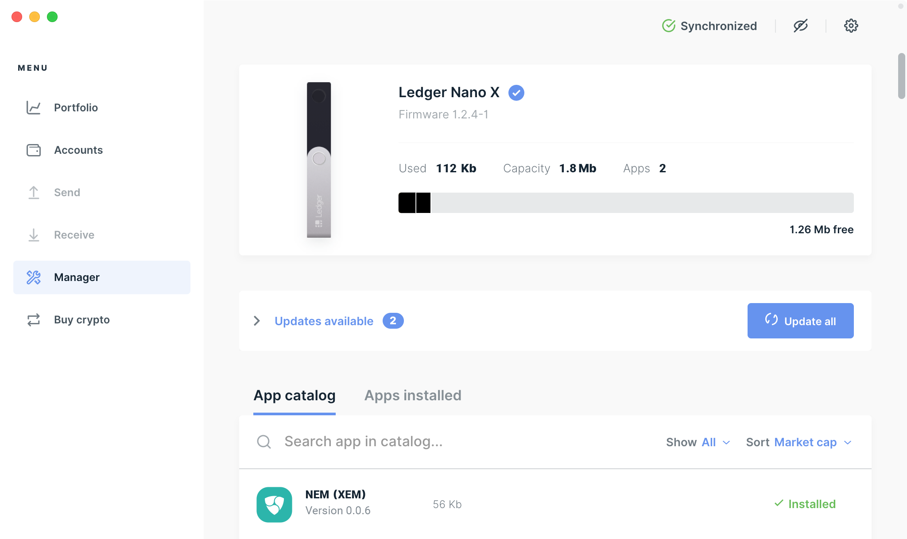

## Step 2: Open NEM app on Ledger device

1. Find the NEM app in your Ledger device by pressing the left and right buttons.
2. Press both left and right buttons simultaneously to open the NEM app. 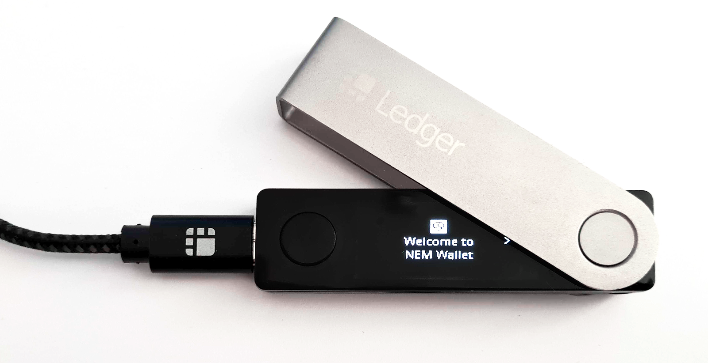

## Step 3: Launch the NEM Wallet for Desktop

1. Launch the NEM Wallet. 
2. Click **Login** in the header menu. 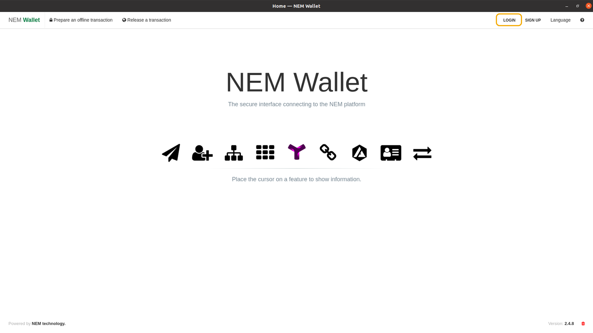
3. Click the **Login with LEDGER NANO** button. Make sure the NEM app is loaded in your Ledger Device. 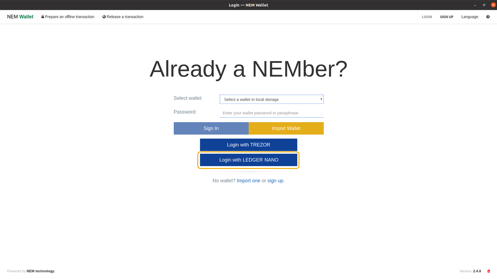
4. Select **Mainnet** network, then click the **Next** button. A popup will appear to check your Ledger device. 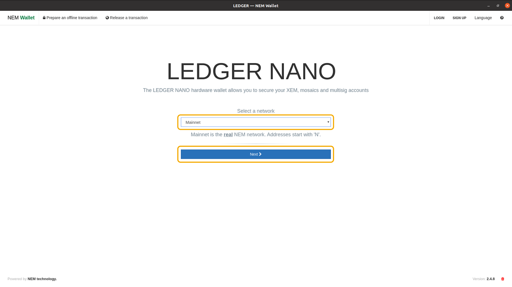

## Step 4: Verify NEM address in the Ledger device

1. Press the right button of your Ledger device to verify your address. This is the NEM address generated by the device synced to the NEM Wallet. 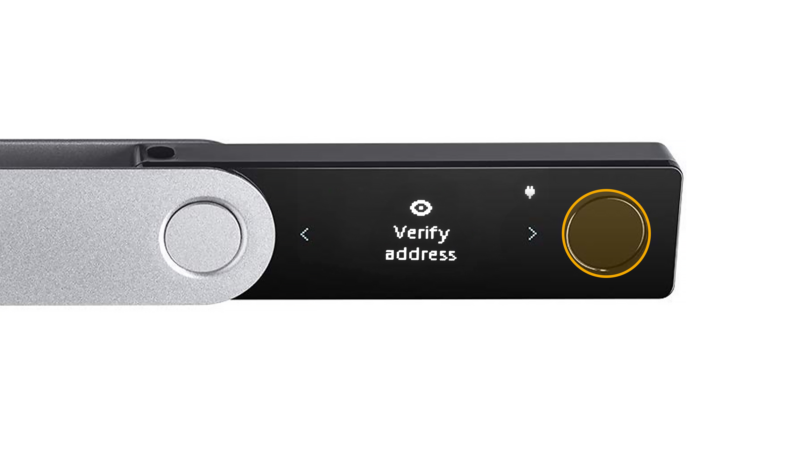
2. Review your NEM address, then press the right button. In this tutorial, the NEM address is shown below. 
3. Press both left and right buttons simultaneously to approve. 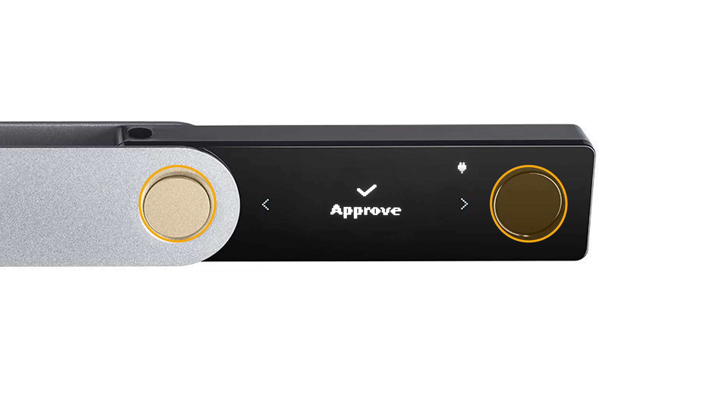

## Step 5: Send and receive XEM in the Ledger device

1. After completing the steps mentioned above, you will be redirected to the NEM Wallet dashboard where you can view all the transactions coming in and out of your Ledger device.
2. Your account balance is shown in the header menu while the XEM market information is displayed on the right side panel. 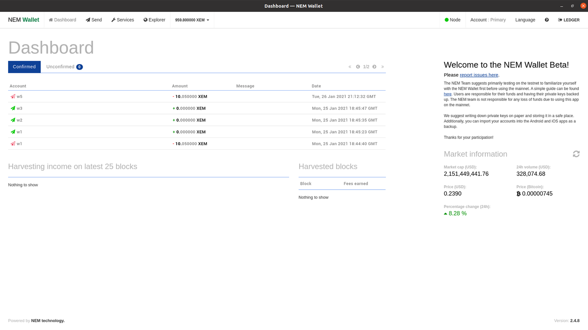

**IMPORTANT**: When initializing a transaction in your NEM Wallet, always verify if the data (e.g. NEM address, XEM amount) matches with the corresponding data displayed on your Ledger device. If the two data match, you can proceed with the transaction; otherwise, you should NOT continue.

## How to receive XEM

1. Click **Account** in the header menu. 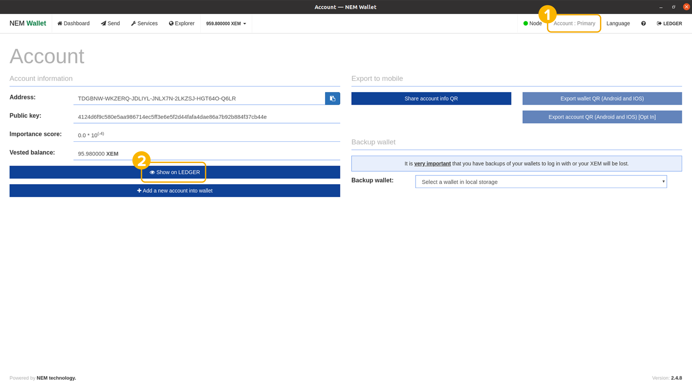
2. Click the **Show on LEDGER** button to verify your NEM address. If the address in your NEM Wallet matches with the address in your Ledger device, you can rest assured that it is true and genuine.
3. Once verified, you can now share your NEM address with the sender.

## How to send XEM

1. Click the **Send** button in the top menu
2. Fill out the required fields. 
   1. **To** - the receiver’s NEM address. 
   2. **Amount** - the amount you are sending to the receiver.  
   3. **Message** - **IMPORTANT**: If you are sending XEM to an exchange, you might need to add an unencrypted message. Please read carefully the instructions provided by the exchange.
3. Click the **Send** button. Note that there will be a fee for every transaction made. 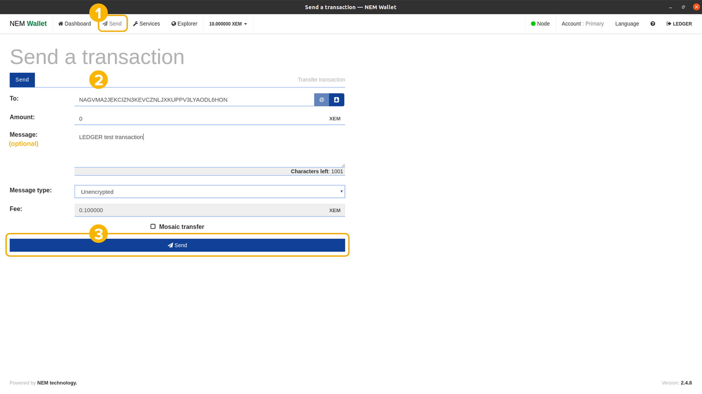
4. Review each transaction detail in your Ledger device and press the right button to continue.
   1. Transaction Type 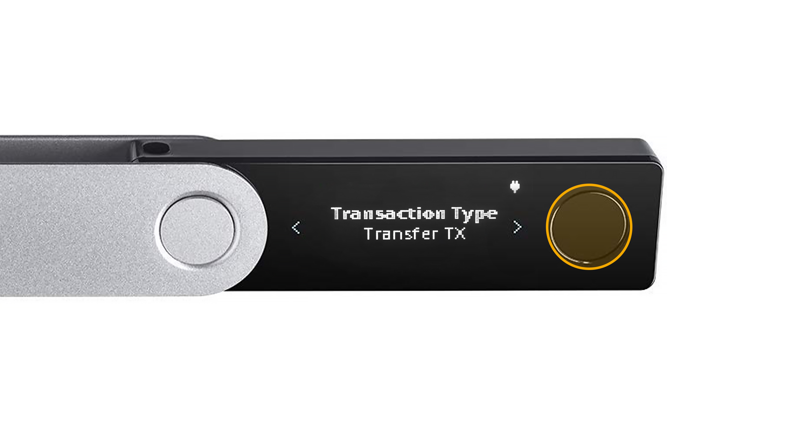
   2. Recipient's NEM address 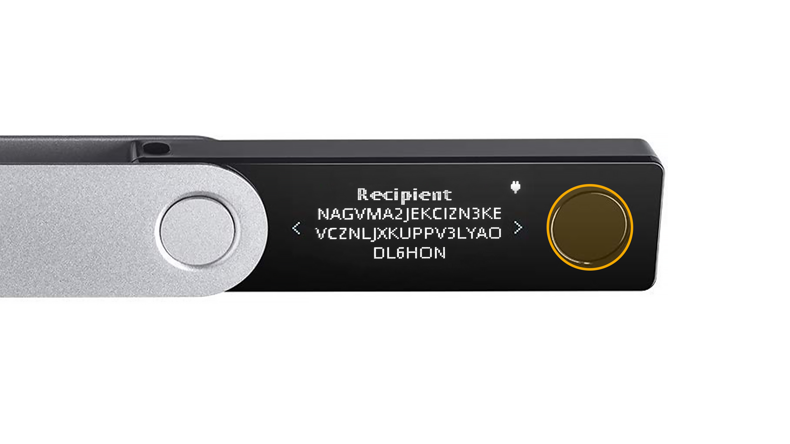
   3. Amount 
   4. Message 
   5. Fee 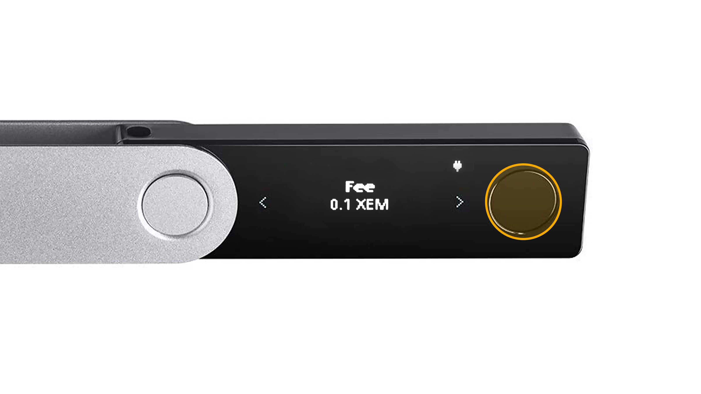
5. If all data are correct, press both left and right buttons simultaneously to approve and sign the transaction. 

## How to view transaction details

As mentioned above, you can view all the transactions coming in and out of your Ledger device through the NEM Wallet dashboard.

1. Go to **Dashboard**. 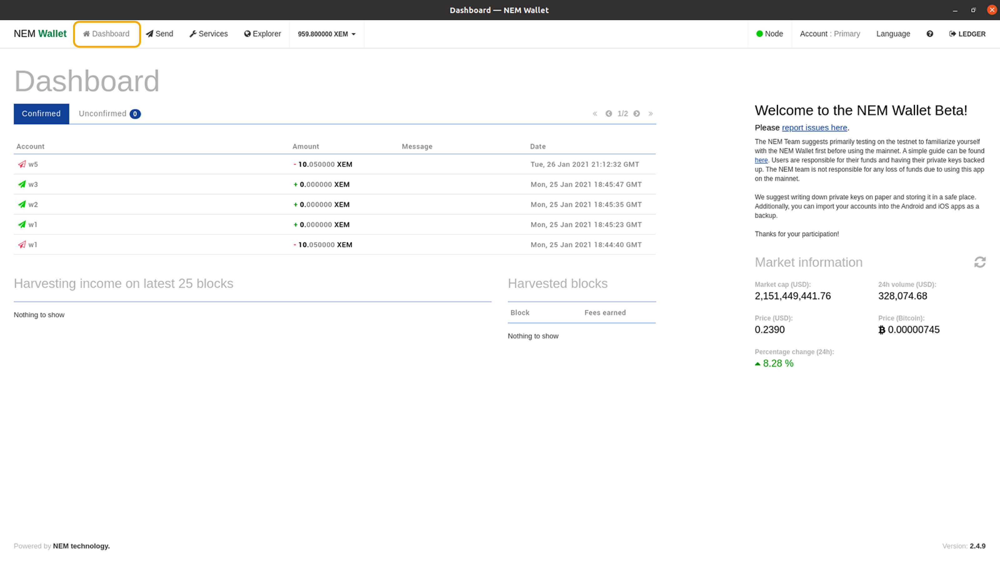
2. Click the transaction you want to view. 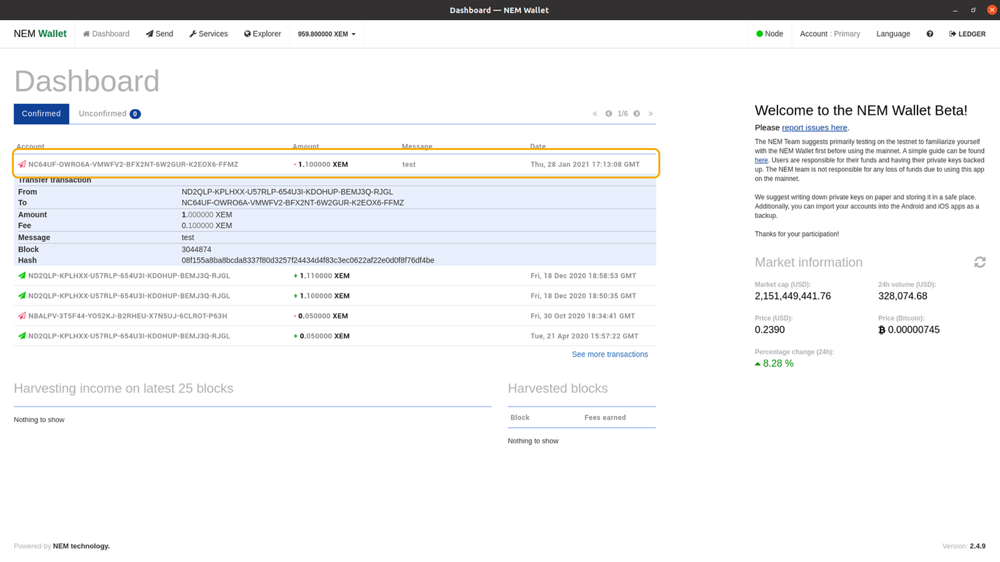

You can also view the transaction details in the [NEM Blockchain Explorer](https://explorer.nemtool.com/) by using the **Hash** data.

## Features

Ledger device integration allows you to use the following NEM Wallet features:
- Send transactions
- Sign and Send multi-signature transactions
- Create and Edit multi-signature accounts
- Create namespaces
- Create mosaics
- Enable delegated harvesting
- Vote on polls through the Voting module

## Contact Support

For technical support, you may reach us at:
- **Discord**: https://discord.com/invite/xymcity
- **Telegram**: @nemhelpdesk