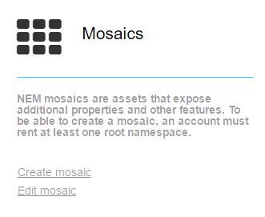
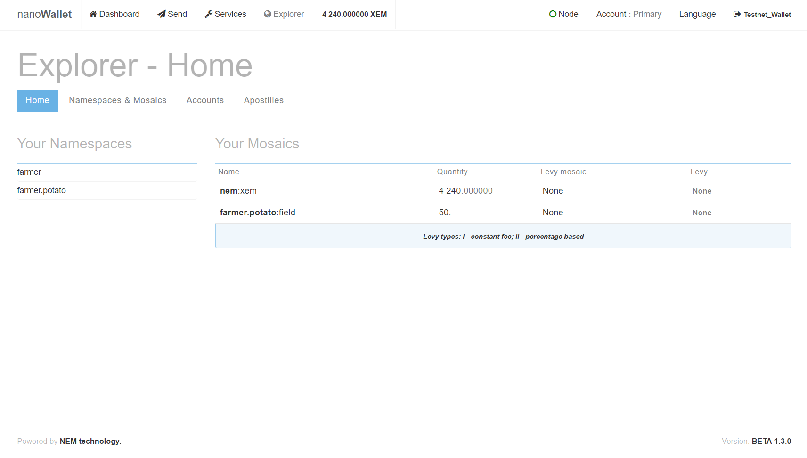
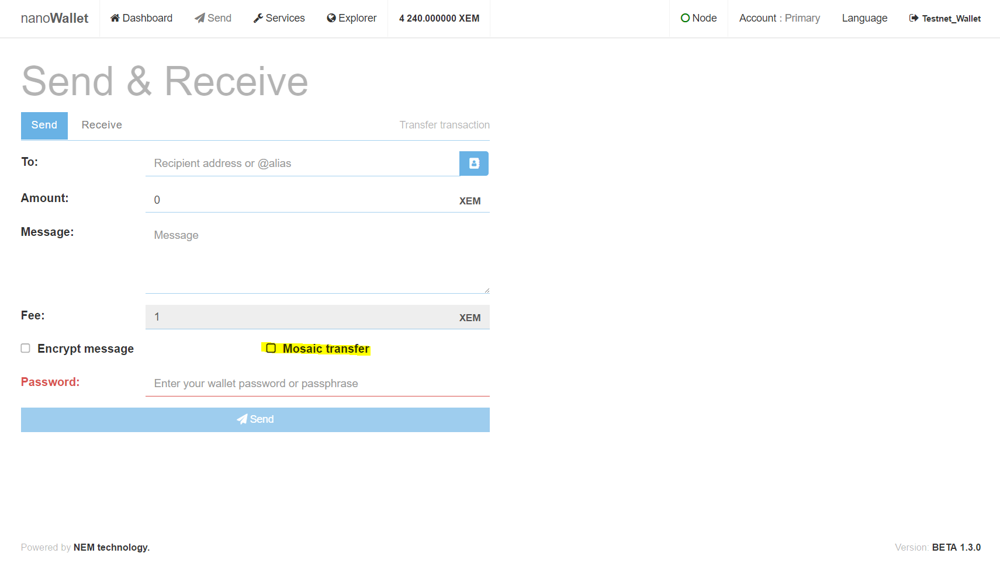
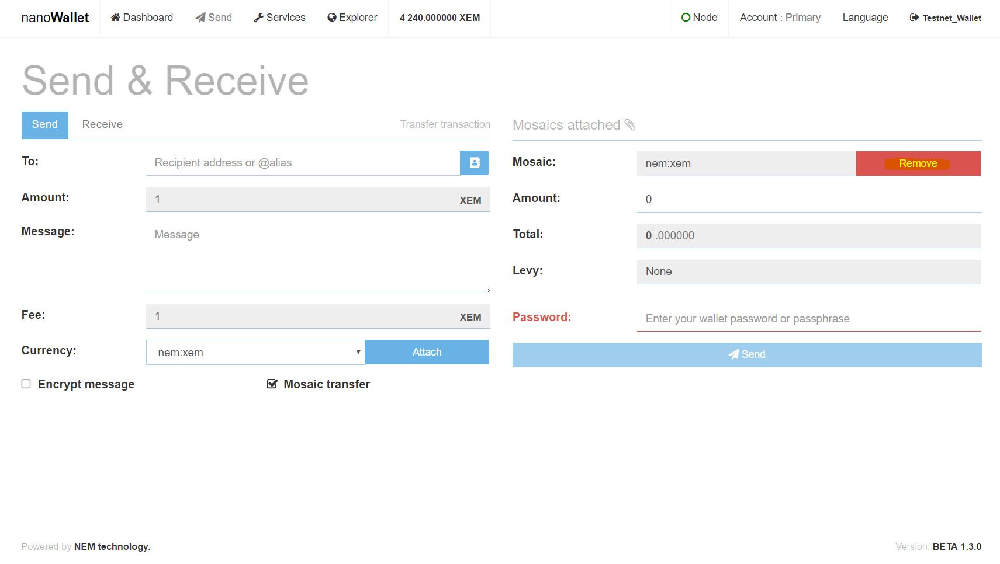
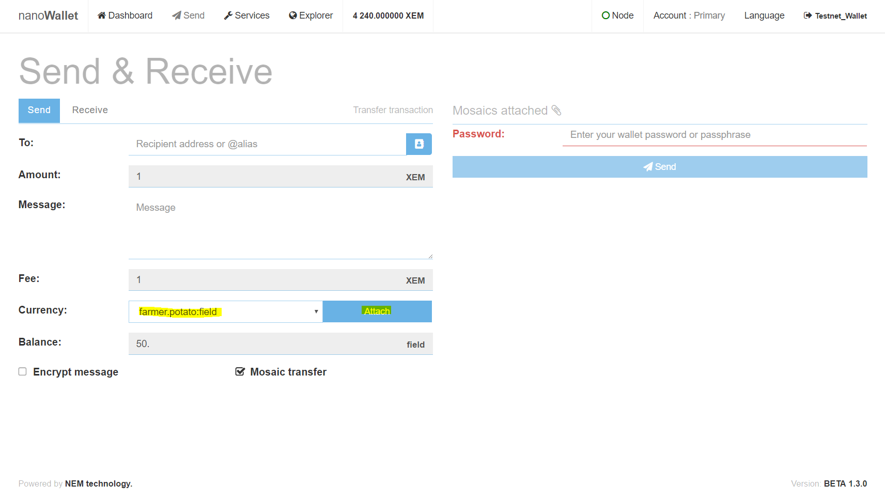
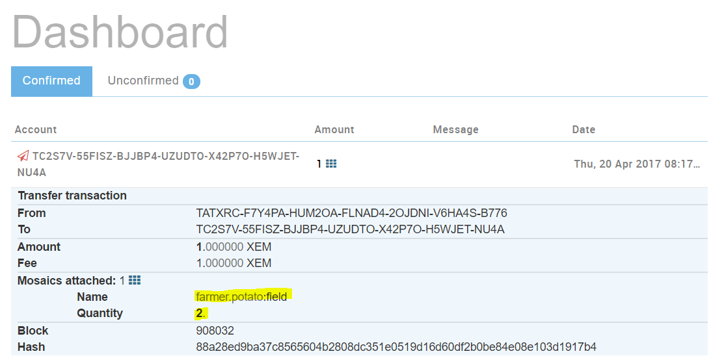

* TOC
{:toc}

[After the creation of the Namespaces](../namespaces/docs.en.md), we move on to create a mosaic for the 50 potato fields.

Go to the Services tab in the NanoWallet and find the Mosaics link.

Open the link and take a look at the Create a Mosaic screen. Then continue to the next section.

## Create a Mosaic Asset

**Mosaic definition**:

- Parent Namespace: select ``farmer.potato``
- Mosaic name: ``field`` (this is the name of the mosaic)
- Description (optional): a short text description
- Password: Your wallet-password

**Mosaic properties**:

- Initial supply: 50 (50 fields)
- Divisibility: 0 (fields are not divisible)
- Transferable: Means, the mosaic is transferable
- Mutable supply: Means, the supply can be changed up or down in the future

### Creating a Mosaic Asset

Once you have entered all the values, click "Send". Go to the Dashboard and check, if the creation was successful.

If you open the "Explorer", you can see that you now own 50 assets of ``farmer.potato:field``

## Transfer of Mosaics

### Introduction

Everything is set up now and you are ready to sell your first field(s) to investors. Since you are using NEM to manage your fields, your investors also need to set up a NEM NanoWallet. Once done, they can send you their account address.

### Transfer (farmers view)

Investor 1 (Alice) has set up the NanoWallet and wants to buy **2 fields** from you.
The account address from Alice is: TC2S7V-55FISZ-BJJBP4-UZUDTO-X42P7O-H5WJET-NU4A

To send 2 fields to the account, go to Send in NanoWallet and choose "Mosaic transfer":

Remove the "nem:xem" mosaic:

Choose "farmer.potato:field" from the "Currency" dropdown and click "Attach":

Add the account address from Alice in the "To" field. Set the amount for the field(s) on the right side, enter your wallet-password and click "Send":

Once you have sent the mosaic asset(s), go to the Dashboard and check, if the transfer was successful:

### Transfer (investors view)

Alice will see the incoming transactions on her Dashboard:

To check all her owned mosaics, the investor can open the Explorer:

## Change of supply

Your business runs great, in fact, you are thinking about adding another 50 potato fields to your farm.
How to add those new fields to your Mosaic?
Go to Services - "edit mosaic":

- Select mosaic: ``farmer.potato:field``
- Change type: create
- Change amount: 50

Check the resulting supply for errors and click "send." Done.

**You can only change the supply if you intially made the mosaic mutable.**
