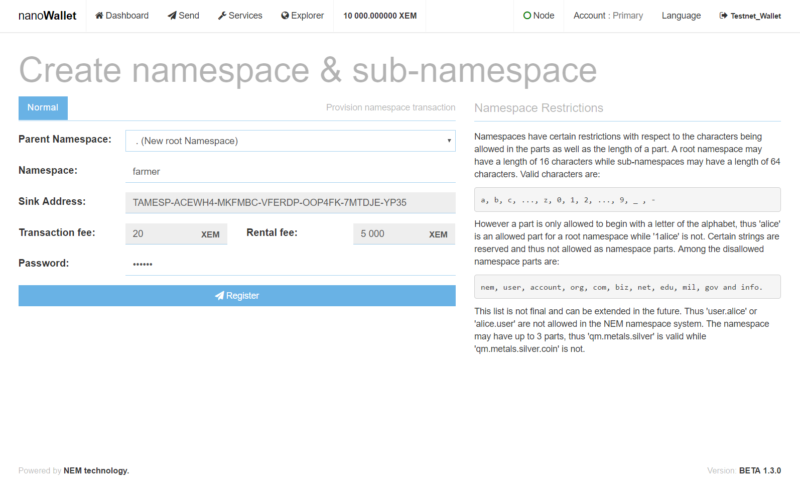
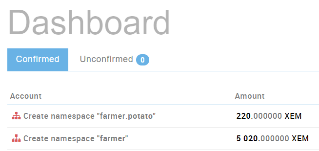

[Deutsch](https://web.archive.org/web/20210814074405/https://forum.nem.io/t/how-to-make-your-first-namespace-and-mosaic/3898/2)

This guide will cover the basic setup of namespaces and mosaics in the NanoWallet.

To create a namespace you need to pay the following fees: (note that fees may change.)

- 100 XEM for the root namespace
- 10 XEM for every subnamespace

To create a mosaic you need:

- 10 XEM

## Example

You are a farmer with 50 potato fields. Since 50 fields are too many for yourself, you start to think about selling some of the fields to investors.

How can this be done with NEM and NanoWallet?
With namespaces and mosaics of course...

## Creating a namespace

### Introduction

Before we create a mosaic to represent the 50 fields, we need to create a namespace and we will also create a sub-namespace. For this example, we create a root-namespace for the farmer and a sub-namespace for the potato fields.

A root-namespace can be compared to a web domain, for example, ``nem.io.``.
A sub-namespace can be compared to a sub-domain such as ``blog.nem.io``.

**The following namespaces have to be created:**

- Root-namespace: ``farmer``
- Sub-namespace: ``potato`` (``farmer.potato``)

### Creation of root- and sub-namespaces

Login to the NanoWallet, go to Services and choose "Create namespace".
First, we create the root namespace.

- Parent Namespace: select ". (New root Namespace)"
- Namespace: farmer (this is the name of the namespace)
- Password: Your wallet-password

Once you have entered the values, click "Register". Go to the Dashboard and check, if the registration was successful:

Now that the root-namespace exists, we can create a sub-namespace.

- Parent Namespace: select "farmer"
- Namespace: potato (this is the name of the sub-namespace)
- Password: Your wallet-password

Once you have entered the values, click "Register". Go to the Dashboard and check, if the registration was successful:

## Alias System

NEM's namespaces also act as aliases for addresses. Since every namespace is associated with a specific account, it's possible to use each namespace in place of an account address by adding @ to the front.

For example, the namespace ``crypto.news`` is associated with its owner's address ``NAWNNR-2SEDKU-YOBSKU-Q3VLZE-7WQW3D-YJ6UTE-SXOJ``.

If you want to send a transaction to this account, you can enter ``@crypto.news`` in the recipient's address field and the transaction will reach that address.

This is useful because it makes it easy to tell whether you are really sending funds to a legitimate crypto.news address, as opposed to a 40-digit address string which could belong to anyone.
