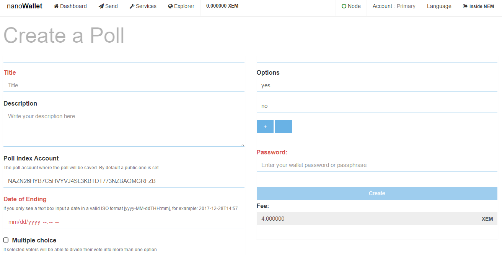
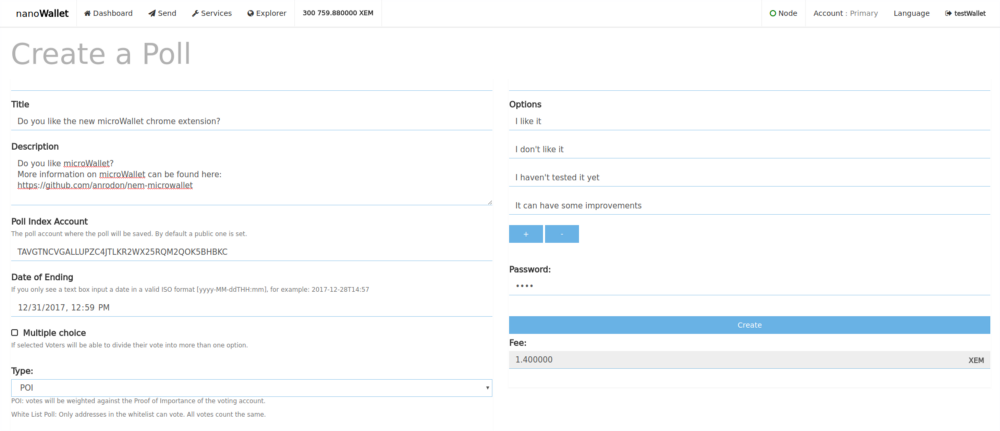
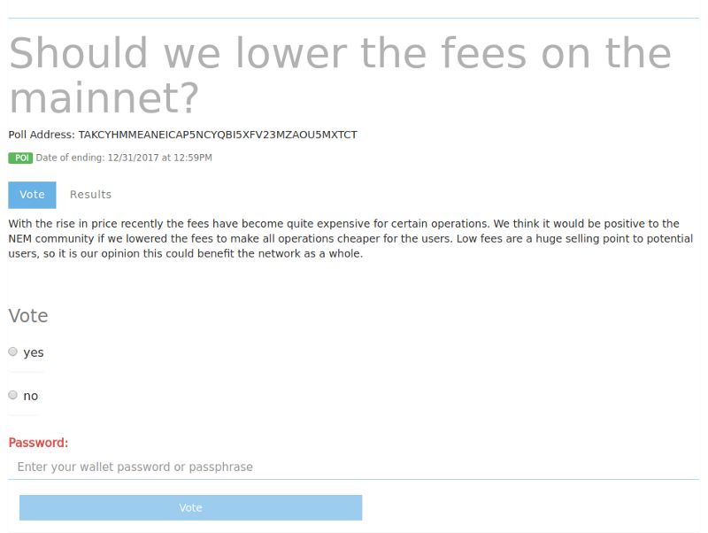
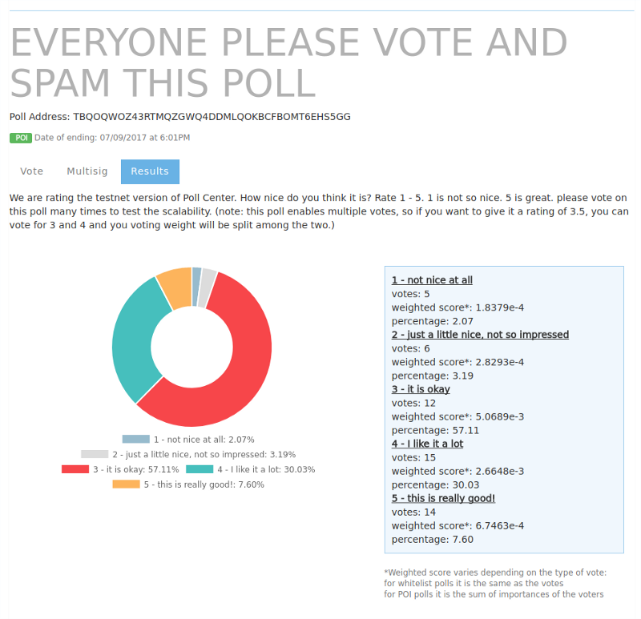
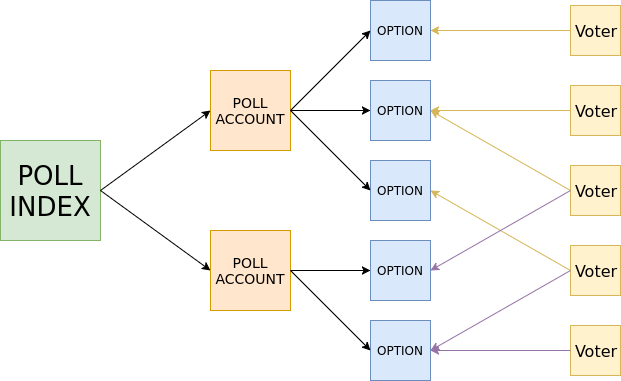

* TOC
{:toc}

The NEM voting platform is a NanoWallet module that allows anyone to create and vote on polls stored on the NEM blockchain. The vote counting is done by the client with open source code so it is completely transparent. All the information is publicly available to everybody.

To create a poll, log into your NanoWallet and click on the Services tab at the top of the page.

Scroll down until you see the Voting Module and select Create Poll.

This opens the Create a Poll page. Here you can name your poll, describe the rules, set an end date, and create the various options people will be voting on. Once you have defined all your parameters, enter your password and press the Create button to start the poll.

## Creating a Poll

Example of a poll creation form on the testnet:

On the Create poll option you will find a form with all the information needed for a poll to be created. There is a small description for each field.

The fields that define a poll are:

* **Title**: This is a short title people will see on the poll index and when opening the poll.
* **Description**: The description’s purpose is to explain what the poll is about and to include relevant information. The description field is not required but it is strongly encouraged so people know exactly what they are voting on.
* **Poll Index**: The address of the index account to send the poll. By default a public one is set.
* **Date of Ending**: The date and time the poll will end and no more votes will be counted.
* **Multiple**: you can choose whether or not the vote will allow multiple options. In this case vote weights will be split between the different options a voter chooses.
* **Type**: The type of vote counting (details below.)
* **Options**: The options voters will be able to choose from.
* **Whitelist**: This is only used for white list polls, where only votes from the specified addresses will be accepted.

When creating a poll the user can specify the way votes will be weighted. Currently there are two options:

* **POI**: Proof of Importance is a great tool for weighing the votes on polls, especially those that affect the NEM community. In the voting platform we make it possible to use the importance score, intrinsic to NEM, to weight votes in a simple way.
* **White List**: On simple polls every vote counts the same. A whitelist is required for this type since anybody can create as many NEM accounts as they want.

## Voting and Viewing Results

On the See Polls option you can observe a list of all the polls submitted to the current poll index, which at the start will be the default index. If you click on any of the polls the details of the poll will be loaded from the blockchain and displayed. On the bottom there is a button for refreshing the polls on the index.

### Voting on a Poll

If everything is correct (you have voting permissions and you have not previously voted) you can send your vote.
If you are cosignatory of a multisig account, you will see a multisig tab, where you can choose from all your multisig accounts and cast a vote for them, which will appear as a multisig transaction to all the cosignatories.
On the options tab you can find a bar where you can input a NEM address pertaining to a poll or a poll index to display them. You can also create a new poll index and see a list of your created poll indexes if you have any.

### Results of a Poll in the Testnet

You can display the results of the poll by going into the results tab. If the poll is ongoing the results are not definitive since they are checked on the current block, and importance scores are likely to change.
If the poll has ended the results are definitive and are counted from historical data. The counting automatically pulls data from a node that has historical data activated.

## Technical Details

Account Structure of The module. Colored arrows are messages.

There are 4 main concepts on the data structure of the module:

1. Poll Index Account (PI)
2. Poll Account (PA)
3. Option Account (OA)
4. Voter Account (V)

When a poll is created the first thing that happens is the creation of a poll account. Then the creator sends all the poll information to the poll account as messages in NEM transactions. This information includes things like the title, the type, the description, etc.

Next, an option account is created for each of the options the poll has. A message is then sent to the poll account containing the addresses of all the option accounts, together with their descriptions.

If the previous steps have succeeded, now the poll is correctly formed and can start receiving votes, but first we will add it to a poll index. This is done by sending the index account some information abut the poll, but not all, so that it can be loaded faster. We call this the poll header, and it contains the address of the poll account, the title, the type, etc.

Now, after waiting for the message confirmations, the poll Is correctly formed and can be displayed and found on the poll index. You can now vote on it.

Each vote is sent as an empty NEM transaction to the chosen option account. The transaction doesn’t send any XEM or message, the cost of a vote is simply the fee (1 xem for normal votes, 7 xem for multisig votes.)

Anyone can create a new poll index. When creating a poll index a new NEM account is created, and two messages are sent by the creator. The first message is to the poll index, declaring it as such and sending information to it. Poll index information designates whether it is a private index, and if so, it has the address of the creator.

The second message is sent to the creator account from itself containing the index’s address, so a user can find all the polls created by him/herself by looking at the self-sent messages.

Private indexes can be created, where only the creator of the index account can submit polls, and when seeing the poll list from such an index, all polls not created by the index owner will be ignored.

While the voting is still ongoing a temporary result is calculated pulling data from the current block in the blockchain. Once the poll ends the result is calculated from historical blockchain data.

### Additional Comments

NEM plans to implement another type of vote counting in the future which will use mosaics to weight the votes. This will introduce interesting ways to create votes. For example if you have a company and you want to have an internal vote you can create a mosaic and distribute it. You could even send more mosaics to more important figures on the company. You could also have POS (proof of stake) counting by using XEM as the mosaic.

Special thanks to the whole Atraura team for helping with the development of the project.
