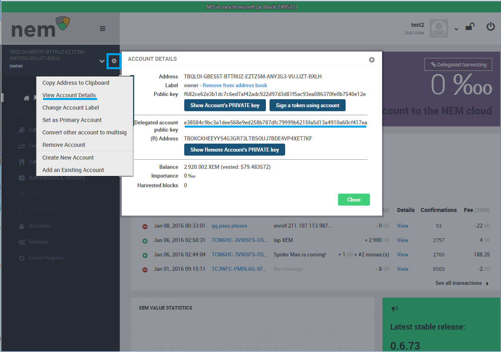

## About Supernodes

The NEM Supernode's program is funded with XEM set aside during the Nemesis block. These awards are then given to high performance nodes for helping to secure the network. These nodes form a backbone of support for [light wallets](http://nem.ghost.io/lightwallet/), mobile wallets, and 3rd party apps so that users of these services might have access to the network that is easy, fast, and reliable without having to sync a blockchain by themselves or use untrustworthy centralized services.

The NEM network has been designed from the very beginning with the goal in mind that any light client can securely connect to and use any server safely to make any transaction. Supernodes are expected to be high performance and reliable nodes. They are regularly tested on their bandwidth, chain height, chain parts, computing power, version, ping, and responsiveness to make sure that they are performing to high standards. If they meet all these requirements, they are randomly given rewards.

The Supernodes program is currently undergoing alpha testing and is looking for volunteer nodes to participate. During this phase of testing, rewards will **not** be distributed. Once the Supernode network is working and all parameters configured properly a date for the official start will be announced.

## Steps to Enroll and Participate in Supernodes

- **Step 1**: Download and run the standalone version of NEM from [the GitHub releases page](https://github.com/NemProject/NanoWallet/releases).

  The standalone tutorials for Mac, Ubuntu, and Windows can be found at the [NEM Tutorials Index](http://nem.ghost.io/nem-tutorial-list/).

- **Step 2**: Make an account and have at least 3,000,030 XEM in an account.

  3 million XEM to be able to participate in the program, and 30 XEM to be able to pay the fees for activating delegated harvesting and sending the enrollment message. The message fee depends on the size of the message text, so 30 XEM might be a little bit more than you really need.

- **Step 3**: Activate delegated harvesting on your main account.

  A tutorial can be found [here](http://nem.ghost.io/how-to-use-delegated-harvesting/).
  
  Remember, 6 hours must pass before you can start harvesting, but for the sake of supernodes, once you have the delegated private key (which is available instantly), you may proceed. (Please make sure to get the private key from the **delegated** harvesting account, not your main account and not either of the public keys.)

- **Step 4**: Shut down NIS, if running.

- **Step 5**: Configure your NIS to autoboot with the **delegated** private key.

  To find your delegated private key please use NCC and go to *View Account Details* and then *Show Remote Account's PRIVATE Key*.

  You will need to edit the config file in your NIS folder to do this. Here is some help:

  When you unzipped the standalone you made a folder called ``package``. Open that folder and double click on the folder ``nis`` and then open the file ``config.properties`` with a text editor. You will then need to find line 43 which says ``#nis.bootKey =``. Now delete the "#" so it only says  ``nis.bootKey =``. Next delete ``#0123456789abcdef0123456789abcdef0123456789abcdef0123456789abcdef`` and replace it with your delegate private key you just made, and again don't keep the "#".

  Next in line 44, ``#nis.bootName``, remove the "#" and then erase "foobar" and instead write the name of your node. Any name is fine. Lastly, set ``nis.shouldAutoHarvestOnBoot`` to true.

  

  Save your edits and close the text editor.

  Please review this [tutorial](http://nem.ghost.io/nis-auto-start-and-auto-harvest/) if you need more help.

  To test if you have done this correctly restart your standalone NIS and NCC. If you have followed all steps correctly, you will see that your NIS is booting and synchronizing automatically, even if you didn't log into your wallet yet.

- **Step 6**: Download the [node servant program](https://drive.google.com/open?id=0B_0Z9jDGHPxPVmdCVDFTT25CXzg).
  
  This is a very light application that will run 24/7 on the same machine as your NIS to perform tests and monitor the network.

- **Step 7**: Configure the servant.

  Unzip and open the folder ``supernodes``. Open the ``servant`` folder. Open the file ``config.properties`` with a text editor. In your text editor enter your static IP or host name for the ``nem.host`` field. (It is important that your host name or static IP associated with your node is fixed for the stability of the network.) Then in the field ``servant.key`` enter your delegated private key from your account with 3 million XEM (again make sure to use your delegated private key and not your main account private key. This will be the same key you used earlier). Save your edits and close the text editor.

  

- **Step 8**: Open inbound/outbound TCP ports 7890 (NIS), 7880 (servant), and 7778 (websocket for lightwallet).

  Opening 7890 allows your node to be a full node and contribute to the network. Please review the [configuration tutorial](http://nem.ghost.io/easy-configuration-guide-opening-port-7890/). If you were successful you will see your node's name appear on [Nembex](http://chain.nem.ninja/#/nodes/). This might take an hour or so to appear.

  Opening port 7880 is required to allow the servant to work correctly.

  Port 7778 allows light wallets to connect to the server.

- **Step 9**: Start NIS, let it synchronize and then start the servant.

  To start the servant double click on ``runservant.bat`` in the ``servant`` folder (In Mac or Linux navigate to the file in terminal and use the command ``sh startservant.sh``). If it works you will see your terminal/command prompt window become active.

- **Step 10**: Send an unencrypted enrollment message to the official node rewards account.

  Send a NEM message to ``NAFUNDBUKIOSTMD4BNXL7ZFE735QHN7A3FBS6CMY`` stating "enroll (your IP or hostname) (your nodes name) (your delegated harvesting public key)" from the primary account that has the 3 million XEM deposit to officially announce you would like to participate in the program. To find the delegated public key, open your 3 million XEM account in NCC. Go to *View Account Details* and then you can see the delegated account's public key. Please note that this is **not** the delegated harvesting **private** key you used earlier.

  

  

- **Step 11**: Review your results at [supernodes.nem.io](http://supernodes.nem.io/) to make sure that your node is passing all the tests. Please be patient, since your results will not be visible immediately.

  For more discussion about this blog, please visit the [NEM Forum](https://web.archive.org/web/20210814074405/https://forum.nem.io/t/nem-supernode-rewards-program/1735).

## Editing Your Supernode IP and Alias

Some node admins will need to change there IP from time to time as they move hosting services. Or at some point a node admin might want to change their node name.

In this case you will need to prove that you are still the owner of the account by sending a message from the original account used the first time to enroll. Send the message to ``NAFUNDBUKIOSTMD4BNXL7ZFE735QHN7A3FBS6CMY``.

The message for IP's should be formatted like this, `change ip <old-ip> to <new-ip>`, so basically, "change ip 123.456.789.012 to 098.765.432.109".

The message for alias's should be formatted like this, `change alias <old-alias> to <new-alias>`, so basically, "change alias oldname to newname".

Also please leave a message at the bottom of this NEM Node Rewards thread so that Bloody Rookie knows he must check the above account for new messages.
