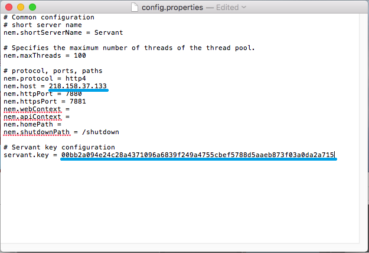
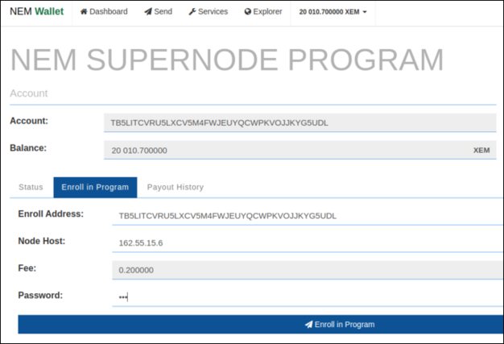
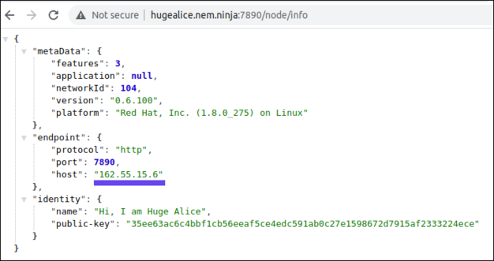

## About the NEM Supernode Program

The NEM Supernode Program rewards high performance validators that participate in the consensus and security of the network, and provide high-speed data availability for applications on the NEM blockchain. NEM's native token XEM was 100% issued in the Genesis block; in lieu of block rewards, 10,000,000 XEM have been set aside for the Supernode Program.

Reward eligibility is determined on a daily basis via four rounds of testing (one round every 6 hours). A participating node must pass all tests in a given day in order to be eligible for a share of that day's rewards. Node testing is facilitated by the controller (a centrally managed Supernode monitoring service). A reference node is also used for comparative purposes in some tests. Each round of testing includes the following tests:

- **Chain Height:**
The chain height test checks that a node reports the correct height via the ``/chain/height API``. It retrieves a node’s height and compares it to the reference node’s height. This test passes if the node reports a height that is no more than four blocks behind the reference node’s height.
- **Chain Part:**
The chain part test checks that a node can serve a random subset of blocks close to the end of the chain via the ``/chain/blocks-after`` API. First, it retrieves a node’s self reported height. Next, it requests a random number of blocks (between 60 and 100) from the node. Finally, it calculates the hash of each block and then a single composite hash over those hashes. The same composite hash is calculated over blocks retrieved from the reference node. This test passes if all returned blocks are verifiable with proper signatures and the calculated composite hashes from the node and reference node match.
- **Balance:**
The balance test checks that a node has a balance of at least 10000 XEM. It requests a node’s main account’s balance via the ``/account/get/forwarded`` API. Unlike the other tests, this request is routed to the reference node. This test passes if the reported balance is at least 10000 XEM.
- **Computing Power:**
The computing power test checks that a node is running on sufficiently strong hardware. The controller calls a node’s ``nr/computing-power`` API with a random hash. The node interprets that hash as a private key and derives a public key from it. It then interprets that new public key as a private key and derives another public key from it. This is repeated 10000 times and the final public key is returned to the controller. This test passes if the public key matches the value calculated by the controller and the entire operation, including roundtrip, completes in 5s or less.
- **Version:**
The version test checks that a node is running a recent version of the NIS client software. It requests a node’s version via the ``/node/info`` API. This test passes if the node’s version is greater than or equal to the reference node’s version.
- **Ping:**
The ping test checks that a node has a sufficiently responsive network connection. The controller selects 5 nodes at random and passes them to the node under test via the ``nr/task/ping`` API. Upon receiving the partner nodes, the node calls the ``nr/ping`` API on each partner 5 times each and measures the roundtrip time. When all pings are complete, the node reports the roundtrip times to the controller. This test passes when no more than one ping fails and the average ping time of all successful samples is less than 200ms.
- **Bandwidth:**
The bandwidth test checks a node is running on hardware with a sufficiently capable network connection. The controller selects the partner node with the lowest ping time as measured by the ping test and passes it to the node under test via the ``nr/task/bandwidth`` API. The controller also sends a random hash seed. The node then sends the random hash seed to the partner, which hashes it 30000 times and returns a list of all resulting hashes concatenated to the seed. The sending node measures the time needed to complete this operation. Finally, the sending node independently performs the same hash calculation and returns the results to the controller. This test passes when the hashes calculated by the node and the partner node are equal and the measured operation time indicates a transfer speed of at least 5 Mbit/s.
- **Responsiveness:**
The responsiveness test checks how quickly a node can respond to a chain height request. The controller initiates 10 chain height requests via the ``/chain/height`` API. It then calculates the total amount of time to fulfill all of the requests. This test passes when at least 9 requests are fulfilled and the total time to fulfill all requests was no greater than one second. If only the time threshold is exceeded, the controller will retry this test up to 4 times.

## Steps to Enroll and Participate in the Supernode Program

- **Step 1**: Download and Launch Latest NEM NanoWallet From [the GitHub Releases Page](https://github.com/NemProject/NanoWallet/releases).

- **Step 2**: Make an Account and Have at Least 10,010 XEM.

  10,000 XEM to be able to participate in the Supernode Program, and ~10 XEM to pay the fees for activating delegated harvesting and sending the enrollment message. (You will need to re-enroll in the Supernode Program every month - 10 XEM should be enough to cover transaction fees for at least a year.)

- **Step 3**: Activate Delegated Harvesting on Your Main Account.

  The tutorial for NEM NanoWallet delegated harvesting can be found [here](https://nemproject.github.io/nem-docs/pages/Guides/nanowallet/delegated-harvesting/docs.en.html#activation).

  Six (6) hours must pass before you can start harvesting, but enrollment in the Supernode Program can be initiated once you have the delegated private key (available immediately).
  
  It's important to understand the difference between Main and Delegated Key Pairs which are used in NEM:
  - Main - Is used to control funds for your account. If the main private key will be stolen all funds could be transferred to another account. Never expose or share your Main Private Key!
  - Delegated - Is used to control delegated harvesting. If the delegated private key will be stolen your funds are safe. You'll be also able to change the compromised delegated account linked to your Main account.
  
  
  
  To find your delegated private key go to Services -> Delegated Harvesting -> Manage delegated account. Choose "Show delegated account keys", and put the password to reveal the delegated private key.

- **Step 4**: Setup NEM Node.

  If you don't have a NEM node, you need to set up it first. The tutorial can be found [here](https://nemproject.github.io/nem-docs/pages/Guides/node-operation/docs.en.html).

- **Step 5**: Shutdown the NIS Client, if Running.

- **Step 6**: Configure Your NEM Node to Autoboot With the **Delegated** Private Key.

  You will need to edit the config file in your NIS folder to include the **Delegated** Private Key collected in Step 3. Here is some help:

  When you unzipped the standalone you made a folder called ``package``. Open that folder and double-click on the folder ``nis`` and then open the file ``config.properties`` with a text editor. You need to find line which says ``#nis.bootKey =``. Now delete the "#" so it only says ``nis.bootKey =``. Next delete ``#0123456789abcdef0123456789abcdef0123456789abcdef0123456789abcdef`` and replace it with your delegate private key from Step 3.

  In the next line (``#nis.bootName``), remove the "#" and then erase "foobar" and instead write the name of your node. Any name is fine. Lastly, make sure that ``nis.shouldAutoHarvestOnBoot`` is set to ``true``.

  Optionally (node will try to autodetect IP automatically if not defined), you can define your domain or IP using ``nem.host`` property.

  

  Save your edits and close the text editor.

  To test if you have done this correctly restart your node. If you have followed all steps correctly, you will see that your NIS is booting and synchronizing automatically.

- **Step 7**: Download the [Node Servant](https://bob.nem.ninja/servant_0_0_4.zip).
  
  This is a very light application that will run 24/7 on the same machine as your NIS client to perform tests and monitor the network.

- **Step 8**: Configure the Servant.

  Unzip and open the folder ``servant``. Open the file ``config.properties`` with a text editor. In your text editor enter your static IP or domain name for the ``nem.host`` field. (It is important that your domain name or static IP associated with your node is fixed for the stability of the network.) Then in the field ``servant.key`` enter your delegated private key from Step 3. (Again make sure to use your delegated private key and not your main account private key.) Save your edits and close the text editor.

  

- **Step 9**: Open Inbound/Outbound TCP ports 7890 (NIS), 7880 (Servant), and 7778 (Websocket).

  Opening 7890 allows your node to be a full node and contribute to the network. If you were successful you will see your node's name appear on [Explorer](https://explorer.nemtool.com/#/nodelist). This might take a while to appear.

  Opening port 7880 is required to allow the servant to work correctly.

  Port 7778 allows NEM NanoWallet to connect using websockets to the server.

- **Step 10**: Start NIS Client, Let it Synchronize, and Then Start the Servant.

  To start the servant double-click on ``runservant.bat`` in the ``servant`` folder. (In Mac or Linux navigate to the file in terminal and use the command ``sh startservant.sh``. It's recommended to run in background using ``screen`` or ``nohup`` command.)

- **Step 11**: Enroll in the Program.

  Go to Services -> SuperNode Program -> Check & Enroll in Program -> Enroll in Program, put the enrollment address for current month (announced via [Twitter](https://twitter.com/nemofficial) and [Discord](https://www.discord.gg/xymcity)) and host for your NEM node. Send enrollment transaction.

  

  Make sure host matches your node host from ``/node/info`` endpoint response.

  

  As an alternative to enrollment via NEM NanoWallet, you can send enroll transaction manually. It should be transfer transaction with message: ``enroll <NODE_HOST> <CODEWORD_HASH>`` send to current enrollment address. 
  
  As a ``<NODE_HOST>`` you should use host from ``/node/info`` endpoint. Current ``<CODEWORD_HASH>`` can be fetched for specific account by main **public key** (Make sure you are using public - not private key) using Supernode API: ``https://nem.io/supernode/api/codeword/<main_public_Key>``.

- **Step 12**: Review Your Results at [nem.io/supernode](https://nem.io/supernode).

  To make sure your NEM node is passing all the tests review results at [nem.io/supernode](https://nem.io/supernode) web page. Please be patient, since your results will not be visible immediately.

## Editing Your Supernode Host

Some node admins will need to change the IP address or domain from time to time as they move hosting services.

In such a case, you have to modify node configuration and re-send enrollment (Step 11) with a changed Host.

## Monthly Re-enrollment
The Supernode Program requires monthly re-enrollments. We believe the set-and-forget philosophy of node operation rewards unhealthy behaviours, especially in a decentralised network where validators need to make informed decisions pertaining to the state of the network.
Prior to the month-end, a new enrollment address will be announced by [Twitter](https://twitter.com/nemofficial) and [Discord](https://www.discord.gg/xymcity).
The node operator has to re-enroll each month using a new enrollment address. Enrollment for the next month is available 4 days before the end of the preceding month.

Refer to Step 11 in [Steps to Enroll and Participate in the Supernode Program](#steps-to-enroll-and-participate-in-the-supernode-program)